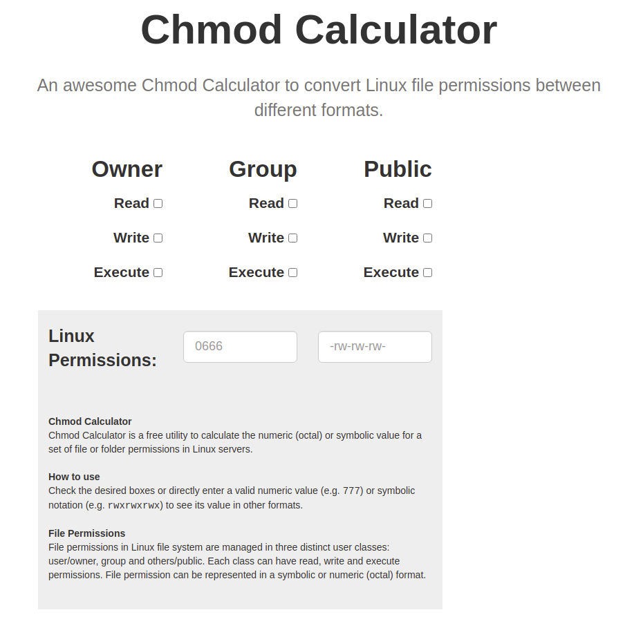

# chmod calculator
When working on our home server I ran into the need for a `chmod` conversion
to get the permissions that I wanted squared away. This was somewhat annoying
having to work through `stat` and some `ls -l`/`ls -aL` nonsense to check permissions
in the `-rw-rw-rw-` format.

To combat this I found [chmod-calculator](https://chmod-calculator.com/), which
gives a quick GUI and the linux permission output.

Example screenshot:

