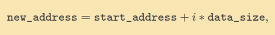

|  Title | Category  | Tags  | Date |
| ------------ | ------------ | ------------ | ----|
| arrays-introduction | dsa  | arrays, arraylists  | 20210604143552 |

# arrays introduction
Arrays are statically allocated, contiguous blocks of memory that provide O(1)
access to a data of a single type. This data is stored at a specified index.

## Arrays
Arrays are not primitive data structures (i.e., ints, floats, chars, boolean). These are used
to store a sequence of related objects/values.

Properties:
* Each array is a sequence of cells with an associated index to the cell.
* Allocations of **contiguous** blocks of memory
* Cells store one element each
* These are flexible and can store a wide variety of data types
* Access is constant time if you know the index of a cell

Arrays do not have to be immediately constructed, they can be initialized with
values, or initialize empty and then fill in later.

## Accessing and searching

### Access
* location (index) is known and is O(1)
* data at index 5 is exactly 5 memory locations away from index 0
* data can be accessed by just adding to the memory address of index 0

```java

// some array of ints
int[] someArray = {0, 1, 2, 3, 4, 5, 6, 7, 8}

```

### Search
* if the location is unknown then the time complexity is O(n)
* searches are linear if we do not know the index (rephrase of above comment)

## Memory
Memory is statically allocated, meaning that the bounds of the array is
the set capacity based on the index count determined at creation.

This is an explanation of why index bound errors exist.

```

// memory would be:
...{0, 1, 2, 3, 4}...
// where this is the bounds

```

### Adding new elements above the size
When adding elements to an array that is already maxed in size we need to re-allocate the memory
then reassign the elements to each position again. This is completed in O(n) time.

This is relatively inefficient.

## Pointer arithmetic
Accessing an index of an array is O(1).

The O(1) efficiency requires 3 things to be true:
1. Memory allocated needs to be contiguous (each array index occupies adjacent memory locations)
1. The array needs to know the memory address of the very first entry in the array, index 0
1. The array's *data typing* needs to be defined before accessing (defined at assignment)

Explanation:
Things we know given the above are that **(1)** the data type tells us how much memory we need to allocate
**(2)** the starting memory address at index 0, **(3)** the numer of memory addresses each
index will occupy given the size, **(4)** that each index is contiguous in memory.

We then use **pointer arithmetic** to find the memory address:
`new_address = start_address + i*data_size`

Pointer arithmetic is O(1) because it is just 3 arithmetic operaitons (instead of **n**, the size of the array)



