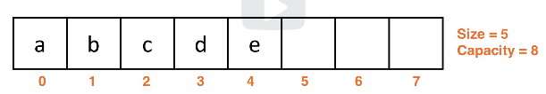

# arraylists introduction
ArrayList is a dynamic, ADT data structure.

## Abstract data types (ADT)
This is a model description of a data type that is defined by the type's behaviors
and operations. This is similar to a Java interface, where there are operations (methods)
that can be utilized, but the implementation is abstract.

An example of the List ADT:
* `addAtIndex(int index, T data)` adds an item to the list
* `removeAtIndex(int index)` removes an item from the list
* `get(int index)` returns data
* `isEmpty()` returns whether the list is empty
* `clear()` resets the list configuraiton with no data
* `size()` returns the number of data currently stored in the list

The List ADT is comprised of different variations of **ArrayLists and LinkedLists**.

## ArrayLists
* a type of `List` backed by an array
* Each of Java's ArrayLists will have to store the object, for primitives this requires an object wrapper

Example in Java:
```java
// ArrayList in Java is from package `java.util`
// The data type must be an `Object`
// generic typing is implied from the declaration statement

ArrayList<String> list = new ArrayList<>();
```

## Dynamic allocation
* an arraylist is an abstraction / a wrapper for an array
* these are resized automatically by the implementation without users knowing
* this is dynamically allocated memory because the array is reallocated and copied when more space is necessary
    * the resizing is still considered O(n) because it is using an array as an underlying component
    * resizing is still a limitation because of the array structure

## Arraylist terminology
* the **size** of the data structure is the # of non-null pieces of data being stored in it
    * this is typically stored in a variable
* the **capacity** of an arraylist is the # of data that can be stored

Ex ArrayList:
```
// This has a size = 5
// and a capacity = 8
[a][b][c][d][e][][][]
```



## Arraylist requirements
* data must be contiguous
    * there cannot be null spaces between the data
* data must be zero-aligned (must start at index 0)
* for efficient operations the size should be stored
    * the index size gives us access to the next empty spot in O(1) time


Ex ArrayList:
```
// data is not contiguous
[b][a][][d][][][][]

// data is contiguous but not zero-aligned
[][b][c][d][][][][]

// properly done
// size = 5
[a][b][c][d][e][][][]
```


## Adding to an arraylist
* we can add to the back in O(1) if resizing is not needed
    * this is due to knowing the size ahead of time
* adding to the back of an arraylist and doing a resize is considered worst-case
    * once the capacity is exceeded we are facing a cost of O(n)
    * the cost of adding is "pessimistic" because the resize step is considered rare
* **amortized analysis** states that looking at the cost over timer ather than the cost per add operation
    * this implies that adding to the back will still be O(1) if we used amortized analysis
    * because we are just repetitively adding to the back during resize, it would be repetitive single operations "n" times

```
// normal O(1) case
// addToBack(f)
// size 5 -> size 6
[a][b][c][d][e][][][] -> [a][b][c][d][e][f][][]

// rare O(n) resize case
//      this requires a resize and each of the data pieces
//      must be copied over
// addToBack(f)
// size 5 -> size 6
[a][b][c][d][e] -> [a][b][c][d][e][f][][][][]
```


## Adding elsewhere
* adding at an arbitrary index is not the "back", it is O(n)
    * we have to add at a position then copy each of the index values to their new positions
    * all data must be shifted, which would then open the cell to insert the data

```
// addAtIndex(1, f)
// all data must be shifted 1 cell at a time
[a][b][c][d][e][] -> [a][f][b][c][d][e]
```

## Remove operations
* removing from the back is O(1)
* removing from an arbitrary index not at the back is O(n) due to data shifting

```
// removeAtIndex(0)
// all data must be shifted 1 cell at a time
// down 1 index
[a][b][c][d][e][] -> [f][b][c][d][e][]
```

