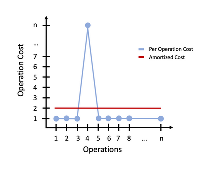
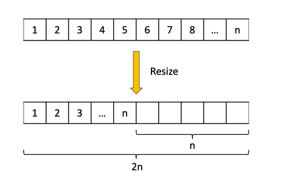

# amortized operation analysis
"spreading cost over time" is the key takeaway for amortized operations.

## Arraylist example
When adding to an arraylist we occassionally have resizes that are O(n); however,
all other additions are O(1) - effectively spreading costs over the life of the list.



## Calculating amortized cost
* Instead of looking at per operation cost we look at **all sequences of n operations and avg. the cost over the #**

### Arraylist calculation:
When adding to the back of an arraylist there are 2 cases to consider
1. Resize
    * O(n) work to be done
1. No resize
    * O(1) work to be done
```
// Sequence of data being added to the ArrayList with no resize operations

Amortized cost = total cost of all operations / # of operations

= 2n / n
= 2
= O(1)
```



* Once an arraylist is resized there are "n" new empty cells to occupy before the next operation
    * after "n" operations we can't trigger another resize in that window
    * **for every sequence of "n" operations we can only trigger a resize once**

* resize cost is "2n" units of time, as we have to:
    1. copy them
    1. place them at a new index

```
// Sequence of data being added to an arraylist with a resize operation

Amortized cost = total cost of all operations / # of operations

= (resize cost + normal operation cost) / n

= (2n + 2n) / n

= 4
= O(1)
```

## Soft v. hard removals
In many array-based data structures you will have the option of a **hard removal** or **soft removal**

* **hard removal** - ensure that the data you removed is completely removed from the backing structure
    * this implies if you search the array the data is gone
    * in an arraylist this is done naturally by the shifting process; however, may have to be done by setting a `null` position for hard removal
* **soft removal** - leaving the data in the data structure unless it is necessary to get rid of it
    * in the arraylist the "end" of the list is controlled by the *size* variable
        * we can technically just change the size of the arraylist without removing the data, if it isn't required

* for this course we will generally do hard removals
    * primarily hard removals are used for sensitive data
    * also helps to make the implementation itself cleaner


