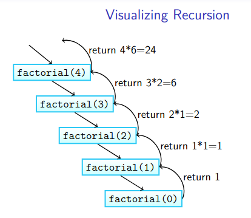
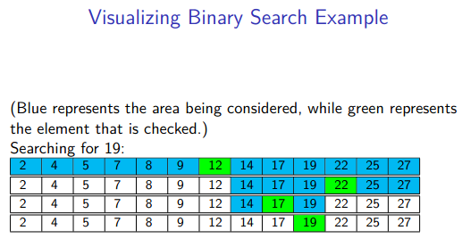

|  Title | Category  | Tags  | Date |
| ------------ | ------------ | ------------ | ----|
| recursion-introduction | dsa  | recursion, math  | 20210606151647 |

# recursion introduction
Recursion is often used in CS to traverse things in data structures.

## Requirements for recursion
* base case: termination conditions that ensure all branches of recursion will stop eventually (avoid stackoverflow errors)
* recursive cases: method calls to itself
    * the method pauses at the line where the recursive call was made
    * this can be changed with a recursive void method
* progress to base case: each call must move towards the base case in some way
    * without the base case we would have infinite recursion

## Basic structure of recursion
1. Starts with a parameter
    1. check the base case logic to ensure if conditions are met
        * this reduces the chance of unnecessary recursive calls
        * the base case may or may not have a return statement
        * cannot have a recursive call insit eit
1. logic for the recursive call is outside the base case checking
    * there can be multiple recursive calls in each statement
    * there can be computations before the recursive call
    * in all calls it is important that a parameter changes to approach the base case

```java
public return_type recursiveEx(param1, ..., param_n) {
    // logic checking
    if (base_case1) {
        // logic for base case 1
    } else if (base_case2) {
        // logic for base case 2
    } // ... etc.
    else {
        // logic for recursive call
        return recursiveEx(newParam_1, ..., newParam_n);
    }
}
```

## Visualizing recursion
Visualizing recursion is important when thinking about problems like **factorials**
and other implementations.

**Visualizing Factorial recursion:**


**Binary search example:**
```
procedure BinarySearch(data, target, low, high)
    if low > high then
        return False
    else
        mid <- (low + high)/2
        if target = data[mid] then
            return True
        else if target < data[mid] then
            return BinarySearch(data, target, low, mid - 1)
        else
            return BinarySearch(data, target, mid + 1, high)
        end if
    end if
end procedure
```



## Finding the subproblem
Recursion is good if you can have a problem that breaks into smaller subproblems.
* Try to figure out the recursive structure of the problem if it is not already defined
    * ex: Power function to calculate b^x where b is an integer and x is power of 2
    * Substructure 1: b^x = b * b^(x-1), b^0 = 1
    * Substructure 2: b^x = b^(x/2) * b^(x/2), b^0 = 1
* write base cases first then the rest of the method
* avoid overlapping base cases (arms-length recursion), this keeps out collisions in base cases
* separate code into clear cases for recursion and base cases

Ex: Euclidean algorithm for greatest common divisor
The greatest common divisor of 2 or more integers, x and y, where x and y are not both zero,
is the largest integer dividing both x and y with no remainder (gcd(x, y))
    * x, y, and z are nonzero pos. integers
    * x > y, then
        * x = q * y + r, r = x mod y, y > r
    * recursive case
        * gcd(x, y) = gcd(y, r)
    * base case
        * gcd(z, 0) return z

```java
// finding greatest common divisor
gcd(1482, 819) -> 1482 % 819 = 663
gcd(819, 663) -> 819 % 663 = 156
gcd(663, 156) -> 663 % 156 = 39
gcd(156, 39) -> 156 % 39 = 0
gcd (39, 0) -> 39
returns 39

// coding the euclidean algorithm
public int gcd(int x, int y) {
    // base case
    if (y == 0) {
        return x;
    } else {
        // recursive call
        int remainder = x % y;
        return gcd(y, remainder);
    }
}
```

## Structural recursion
This is recursion based on some underlying structure or object, rather than
numbers like in factorial, fibonacci, etc.

## Example problem: Increasing Subsequences in Arrays
Suppose that we have an array A of length n as input consisting of n distinct
integers. A subsequence of the array is a sequence of some of the array entries
in the order that they appear.

For example, suppose that we have the array [1,7,3,5,2,8,10,24,−1,−5,4]. Then,
3,2,−1,−5,4 is a valid subsequence since the numbers appear in the sequence in
array order, but 1,7,10,8 is not a valid subsequence. An increasing subsequence
is a subsequence where the numbers go in increasing order. For example, given a
sorted array, every possible subsequence is an increasing subsequence, and
there are 2n of them.

The problem we want to solve here is to count the number of increasing
subsequences there are in the array A. You should try to find a recursive solution
to the problem by finding a proper substructure to break the problem into.
Think about what the subproblems need to be and what information needs to be
kept track of in each subproblem. Once you figure out the recursive structure,
you can probably implement it more easily using a loop than recursively, but
what's most important here is figuring out the recursive structure.

Your solution to this problem should take O(n2) time and O(n) auxiliary space
(space besides the input). If you'd like an added challenge, once you've figured
out the substructure, write a program to print out all of the increasing
subsequences.

```python

# test of recursive subsequence counting
# i think this is incorrect because it does not
# successfully pull the different iterative lengths of
# each iteration?
example_arr = [1, 7, 3, 5, 2, 8, 10, 24, -1, -5, 4]

def num_subsequences(arr, subsequence_count, index_position):
    if index_position == len(arr) - 1:
        print("subsequence count: ", subsequence_count)
        return subsequence_count
    else:
        print("index pos: ", index_position)
        print("arr index: ", arr[index_position])
        print("arr index + 1: ", arr[index_position + 1])
        if arr[index_position] < arr[index_position + 1]:
            subsequence_count += 1
        subsequence_count += 1
        index_position += 1
        return num_subsequences(arr, subsequence_count, index_position)

num_subsequences(example_arr, 0, 0)

```

