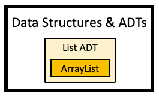
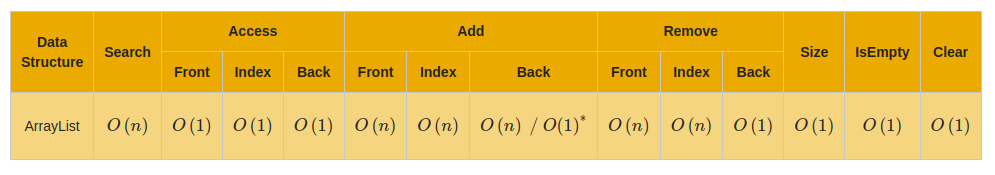

# list arraylist adt
Module review for the different portions covered in the GT module related to
ArrayList and List ADT.

## Big-o
The efficiency for ArrayLists is below. This assumes that there is a `size`
variable. We should be able to figure out time complexities without the `size`
variable if needed.

### ArrayList efficiency
This assumes a `size` variable.

| Function | Method | Efficiency |
| -------- | ------ | ---------- |
| Search |  | O(n) |
| Access |  |  |
|  | accessFront | O(1) |
|  | accessIndex | O(1) |
|  | accessBack  | O(1) |
| Add |  |  |
|  | addToFront | O(n) |
|  | addToIndex | O(n) |
|  | addToBack  | O(n) / O(1)\* |
| Remove |  |  |
|  | removeFromFront | O(n) |
|  | removeFromIndex | O(n) |
|  | removeFromBack  | O(n) |
| Size |  | O(1) |
| isEmpty |  | O(1) |
| Clear |  | O(1) |

Below is a screenshot, should the above table be difficult to read.

