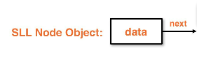
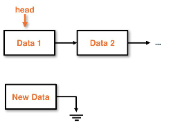
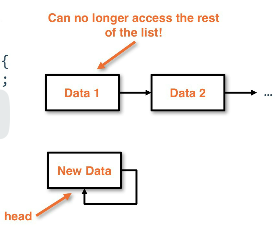
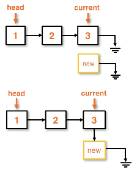
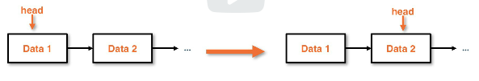
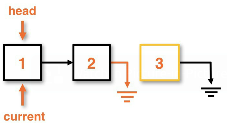
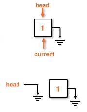
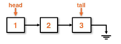
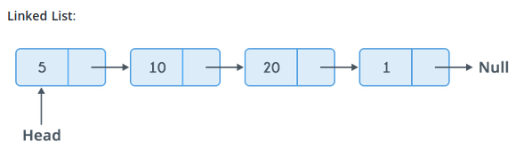

# singly linked lists
Singly-linked lists (SLL) are the basic building blocks of the LinkedList
structural design.

ArrayLists were considered a dynamic data structure, though they require manual
resizing and upkeep in the methods.

LinkedLists do not require resizing operations and can expand indefinitley..



## Linkedlist
These are an alternative to arrays and overcome the some of the
drawbacks of using arrays.

Linkedlist points:
* Implements the list ADT, similar to Arraylist
* does not store data contiguously in memory, data is stored in nodes
* linked data structure is a collection of nodes
    * data is stored in the Node object
    * connections between nodes is done by having each node point to the next node in the list
    * data is not stored contiguously like in ArrayList

### Head pointers
Every node in a linkedlist has a head pointer that points to another node.

* If the **head** is null, then the singly linked list is empty

### Node class
For this example the node class is private, this is to avoid having other external
classes make node objects.

The example below uses a static sub-class from the `SinglyLinkedList` parent.

Attributes on nodes:
* Nodes should only be made by the `SinglyLinkedList`
* A node will have some `data` attribute and a header, `next`
    * in this case the header is an object reference
*

```java
// the parent class has access to the attributes
// of each Node
public class SinglyLinkedList {

    // private sub-class
    private static class Node {
        private int data;
        private Node next; // the reference header

        // constructor
        private Node(int data, Node next) {
            this.data = data;
            this.next = next;
        }

        // alternative constructor chained to the
        // full constructor, adding flexibility
        private Node(int data) { this(data, null); }

    }
}

```

### Adding nodes to the list (method)
After the constructor of the node is complete, helper methods can be added.

**Note**: When reassigning pointers we need to be careful, we can easily
lose track of the rest of the list if our pointer is assigned improperly.

**Adding a node to the front:**
1. Create the node itself
    1. Includes all data required
1. Set the new node's next reference points to the same node as the new node
1. Set the head to be the new node

**Adding a node to the back:**
1. Verify that the list itself is not null
    1. If the list is null, just make a `Node`
1. We have to iterate to the back of the list
1. Once we reach the back of the list (last known node):
    1. Set the `current.next` equal to a new `Node` object

```java

public class SinglyLinkedList {
    // full constructor omitted for brevity

    private Node head;
    public void addToFront(int data) {
        Node newNode = new Node(data);
        newNode.next = head;
        head = newNode;
    }

    public void addToBack(int data) {
        if (head == null) { // List is empty
            head = new Node(data);
        } else {
            Node current = head;
            while (current.next != null) {
                current = current.next;
            }
            current.next = new Node(data);
        }
    }
}

```

Adding Nodes to a the front of a SinglyLinked list:


Adding Nodes improperly can cause a circular pointer reference that loses the list:


Adding Nodes to the back of a SinglyLinked list:


### toString() (method)
There are two implementations of `toString()` for this to
return the data from nodes. One is a public method for the node itself
and the other is a public method for the `SinglyLinkedList` object.


```java
public class SinglyLinkedList {

    // private sub-class
    private static class Node {
        private int data;
        private Node next; // the reference header
        // constructor
        private Node(int data, Node next) {
            this.data = data;
            this.next = next;
        }
        private Node(int data) { this(data, null); }

        // just use the toString() method of the data
        // in this case the data is an `int`
        public String toString() { return Integer.toString(); }

    }

    public String toString() {
        String answer = ""; // keeps track of all the string
        Node current = head; // reference to the current node

        // once we hit the last node, the next one will be null
        while (current != null) {
            answer += current = " ";
            current = current.next;
        }
        return answer;
    }
}

```

### Remove nodes from singlylinked lists
Removing nodes from a singly linked list has different
techniques, some take advantage of **garbage collection**

* In Java's garbage collection once we move a pointer and discard it, it will be deallocated and we cannot retrieve that data again


```java

public class SinglyLinkedList {
    // full constructor omitted for brevity

    // by using garbage collection we can just
    // change the first position to remove
    public void removeFromFront(int data) {
        head = head.next;
    }

    // similar to `addToBack()` we have to modify
    // the list itself
    public void removeFromBack(int data) {
        if (head == null) { return null }
        else if (head.next == null) { head = null; }
        else {
            Node current = head;

            // here we are checking to find the
            // "second to last" node
            while (current.next.next != null) {
                current = current.next;
            }
            current.next = null;
        }
    }
}

```

Removing from the front of a SLL:
* This takes advantage of garbage collection


Removing from the back of a SLL:
* We have to traverse the list with a `current` variable
    * then find the `next.next` where the Node is `null`
    * this then signifies the end of the list, changing the `current` head to `null`


Removing from the back of an SLL has edge cases:
* Removing where the head is `null` just returns `null`

* Removing where the next Node is `null` sets the current head to `null`
    * This takes advantage of garbage collection


## Optimization of the linkedlist

### Size variable
When working through removal having a `size` variable will help to reduce overhead.

A size variable should be maintained when:
* implementing
* adding to the list
* removing from the list

The size can make edge case searches in removal a **concrete** variable to check,
this takes us from O(n) to O(1).

### Tail pointer reference
By having a tail pointer on the list we can have it reference the last node.

A tail pointer would:
* add a pointer to point to the last node in the list
* adding to the back becomes an O(1) operation
* this **does not** solve the problem of removing from the back
* This adds edge cases for transitioning between size 0 and size 1
    * this is due to the head and tail being interrelated in these cases
    * both head and tail would be pointing to the same node

This essentially has the pointers going backwards!



## Adding generic types

```java

public class SinglyLinkedList<T> {
    private static class Node<T> {
        private <T> data;
        private Node<T> next;

        private Node(T data, Node<T> next) {
            this.data = data;
            this.next = next;
        }
        private Node(T data) { this(data, null); }
    }
}

```



