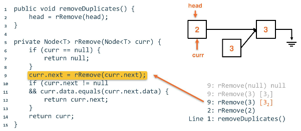

# recursion in linkedlists
Moving recursively through a `SinglyLinked` list to solve a sample problem.

## Problem
Given internal access to a Singly-Linked List with Comparable data,
where all of the data is guaranteed to be in sorted order, remove all
duplicates from the list so that there is at most one of each data.

This task should be done in O(n) time and O(1) space (there is space overhead
for using recursion in the first place, but by O(1) space here, we are referring
to external memory such as creating new nodes, data, etc.).

Recursive removal method:


### Personal attempt
This is my attempt at solving the recursive strategy for deduplicating the data.

```java
import java.util.Iterator;
public class LinkedList<T> implements Iterable<T> {
    // Other methods omitted

    // Returns iterator of the iterable object.
    // This overrides `iterator()`
    public Iterator<T> iterator() {
        return new LLiterator<>(); // generic implementation of `Iterator`
    }

    // Within LinkedList class we implement a subclass
    private class LLIterator implements Iterator<T> {
        private Node<T> curr;
        LLIterator () { curr = head; }
        public boolean hasNext() { return curr != null; }
        public T next() {
            if (hasNext()) {
                T temp = curr.data;
                curr = curr.next;
                return temp;
            }
            return null;
        }
}


// Create a `LinkedList` object
linkedList<String> courses = new LinkedList<>();

// List populated here


public void deduplicate(T current) {

    // check next isn't null
    if (current.next != null) {

        // compare data to next node
        if (current.data == current.next.data) {

            // check if the `next.next` is null
            if (current.next.next != null) {
                current.head = current.next.next;
            } else {
                // end of list if `next.next` null
                current.head = null;
            }

            // garbage collect the same node
            current.next.head = null;

        } else {
            // nodes are different
            // set new `current` to `next head`
            deduplicate(current.next);
        }
    }
}

// calling the above:
someLinkedList.deduplicate(someLinkedList.head);

```

### Recursive remove method
It is common to have a public "wrapper" method to wrap around the recursive
method to keep the user from having to know the implementation.

```java
// SLL class omitted
// no tail reference

public void removeDuplicates() {
    head = rRemove(head);
}

private Node<T> rRemove(Node<T> curr) {
    // null edge case
    if (curr == null) {
        return null;
    }

    // This will traverse the entire list
    // forcing us to return our way back up
    // and remove the nodes in reverse
    curr.next = rRemove(curr.next);
    // eval if the next `Node` is equal to the current
    if (curr.next != null && curr.data.equals(curr.next.data)) {
        return curr.next;
    }
    return curr;
}

```

Traversing the list and finding duplicates


Removing second 3 from the list



Removed second 3, this is the final list


## Thinking recursively
Ideas to keep track of when going through the recursive call stack:
1. A current node is kept to know where we are in the list
1. The head of the smaller, new sublist is kept

* **Note:** Think of this as creating *progressively smaller sublists*

The `base case` that we ned is considered below, this hinges on us passing
sublists into the recursion. The base case is considered an empty list.

Smaller subproblems (lists) are broken linearly by breaking off a link of the list
and recursing on the sublist. This is done by taking advantage of the return field.

Recursion visualized in sublists:


The returned nodes are then compared, forcing us to re-link them to the list.

* **Pointer reinforcement** - The re-linking and restructuring of nodes in the list.
    * Nothing changes in the structure, just "reinforces" the link that was already present

