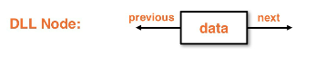

|  Title | Category  | Tags  | Date |
| ------------ | ------------ | ------------ | ----|
| doubly-linked-lists-dll | dsa  | doublylinked list  | 20210611154851 |

# doubly linked lists dll
Singlylinked lists that can traverse backwards.

## Doubly linked lists
* List data structure that holds data in `Node` container object
* Similar to singlylinked version except it holds pointers to both the next and previous nodes
* Almost always has a tail pointer
* Takes the overhead of extra memory in exchange for better time efficiency

Node example:

## Adding to a doublylinked lsit
* Similar edge cases of size 0 and 1 lists
* Have to be careful with pointers because we have twice as many to deal with

Generally we will connect new nodes to the linked list first before altering pointers.
We want to change the pointers later because we would risk losing O(1) access to
the next node.

This would fragment the list into the section pointed to by the head and the
section pointed to by the tail.

Example doublylinked list:

### Adding to the front
1. Create the new node
1. Set the new node's next pointer to the head
1. Set the head's previous pointer to the new node
1. Set head to the new node

Creating a new node

Adding the node and shifting the head

### Adding to the back
1. Create the new node
1. Set the new node's previous pointer to the tail
1. Set the tail's next pointer to the new node
1. Set the tail to the new node

Create a node for the back

Add the node and transition the tail pointers

## Removing from a doublylinked list
Removal from the back is done in O(1) if the doublylinked list has a tail
* The **tail** reference is kept track of within the list implementation itself
* The node has a tail reference, but the parent class ALSO has a tail reference

* We get the second to last node by using the previous pointer of the tail
* Rely on garbage collection to delete our node once we set the tail reference to null
* **remove from the front** is done in the same way, just in reverse

Removing a node from the back of a doublylinked list

An edge case with removal for a doublylinked list is removing from a list of size 1.
* Head and tail references need to point to null to remove the node

The list of length 1 edge case:

