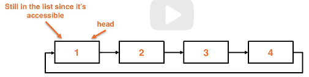

# circularly linked lists
These are linkedlists where the **head** and **tail** nodes connect to each other
rather than to **null** references.

## What is a circularlylinked list
* Type of a linkedlist where the front and back are connected
* Usually this doesn't include a tail pointer
    * This doesn't change our add/remove efficiency
* Termination condition for logic changes due to no "end" to the list
* We can no longer iterate until we're null because this is linked
    * To mitigate this we can utilize a size variable
    * Additionally, we can use the `current.next` to point to the head as a termination condition
* These can be singly or doubly linked lists

Example circularlylinked list

## Adding to a circularlylinked list
* **Adding to the front** we access the back of the list, which we don't have without a tail pointer
* **Adding to the back** requires that we work through a similar workflow as adding to the front

Example of adding to the front:

* We change the head reference to the new node, then have to iterate the list in O(n) to reach our last node
    * Once at the last node we change the tail reference to point to the new node

### Efficient adding to the front
1. Create a new empty node
1. Add the new node at index 1
1. Move the data from the head to the new node
1. Add the new data into the head node

* This ensures that the next reference to the new node is maintained without having to change the pointers

Create a node:

Add the node to the list at index 1 to be copied:

### Adding to the back
1. Create a new empty node
1. Add the new node at index 1
1. Copy data from the head node to the new node
1. Insert new data at the tail node
1. Change the reference for the head to the "new node"

Create a node and insert at index 1:

Shift the data to the new node and change the head reference:

## Removing from the front
* Removing from the front is trickier than just moving the head
* This is an O(1)
* Edge case: If the list is size 1 we have to avoid continually referencing ourself

1. Move the data from `head.next` into the head
1. Remove the second node from the list
    1. Redirect the head's reference to the 3rd in the list, skipping node 2

Removing from the front:

Skip the 2nd node and allow it to be garbage collected:

## Removing from the back
* No special O(1) technique, this is O(n)
* Must use a loop to stop one sort of the last node
* We have to have access to the node itself to remove it, the only way to reach the node is through traversal

Accessing the last node:

## Removing from the middle
* Removing from the middle is the same as a singlylinked list
* We have to traverse in O(n)
* Work through the list and then change the pointer reference once we find the node we want to delete

## Example linkedlists
* Singlylinked list:
    * Web browser sesarch history (back button)
* Doublylinked list:
    * Most recently used cache, music app that keeps song history
* Circularlylinked list:
    * Music playlist that starts over once it completes

