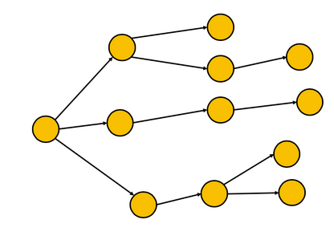
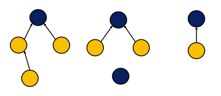
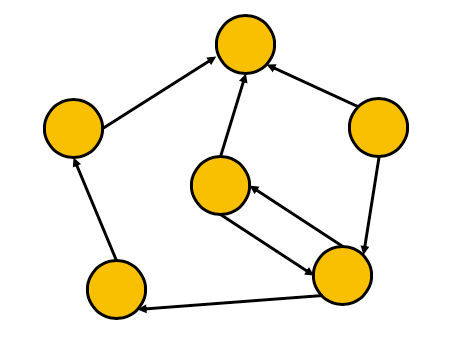

# linked structures
Circularly linked lists are a small change to general linkedlists. These can be
flexible in a large number of ways.

Example, each node "receives" one pointer but can have outgoing pointers:

## Tree structures
These are very common structures, one example is a file system.

Reversing the previous example says we can have multiple pointers being received by 1 pointer:
* This is similar to a folder structure

### Disjoint set
**Disjoint set** system is a grouping where every sequence of node connections
lead to a single, unique node (blue nodes). These are a "representative" for
a grouping of nodes.

## Graph structures
This **graph** structure is a linkedlist with no restrictions on the number of
pointers in or out of a node.

These are used to model relationships between data and are generally a flexible concept.
This is used quite a bit in social networks where nodes represent people and
connections are certain properties that are shared.

