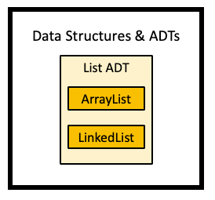
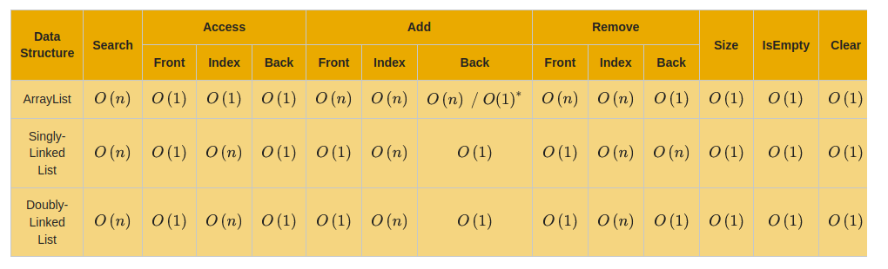

# arraylist linkedlist review
There are two implementations of the List ADT so far, `ArrayList` and `LinkedList`.

Data structures and ADTs so far:

## Big-o review
The `*` indicates that big-o used an amortized analysis.

Assumptions:
* A **size** variable has been used
* Linkedlists have a **tail** reference and are **non-circular**
    * Time complexities for other combinations with no **tail** or circular variants can be derived

Arraylist and linkedlist time complexities:

