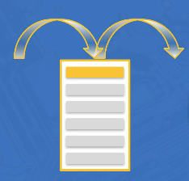
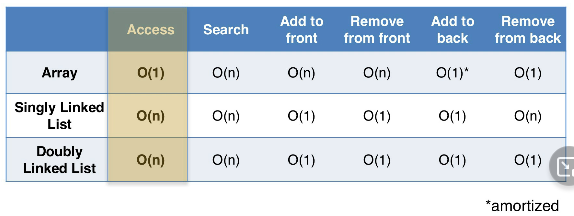
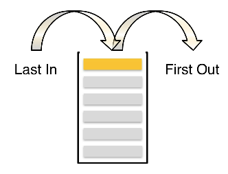
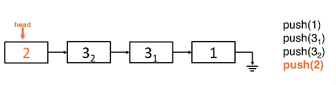
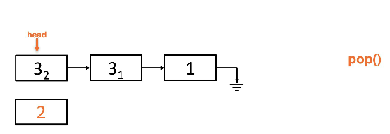
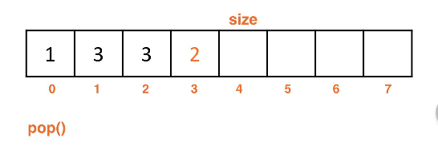

# stack adt lesson
The **Stack ADT** is a model for data that behaves linearly. These are fundamental
to computer science and are found in many implementations.

## Linear abstract data types (ADT)

What makes it linear?
* Finite collection of objects
* A collection is linear if each object has:
    * one immediate predecessor
    * one immediate successor
    * exceptions are the first and last object of the collection

Abstract data type, ADT:
* The data structure that is a container with a finite number of objects (size)
* There is a relationship between the objects being stored
* The low level details are hidden with a "high level idea"
* **Behavior** defines the data abstract data type
    * operations and methods used more closely define the abstract data type

## Potential backing data structures for a Stack ADT
The backing of a Stack ADT can be done in multiple ways.

`Arrays` or `LinkedLists` are the typical backing data structures used.

## Time complexities review
Time ecomplexities of an `Array`, `Singlylinked`, or `Doublylinked` lists.

## What is a Stack?
Stacks are defined by their behavior. The behavior is as follows:
* To add to the stack we `push` data to the top of the stack
* To remove data from the stack we `pop` off the top of the stack
* Stacks are called LIFO - last in first out
* Stacks only have access to the most recently added item
    * This ADT is not made for **searching or accessing** beyond the element that was last added

## Stack supported operations
* a `void push(x)` that pushes to the top of the stack
* a `x pop()` that pulls off the top of the stack and returns the element
* a `x peek() or x top()` method that returns the element on top of the stack without deleting/adding
* the `boolean isEmpty()` methods that check the stack to determine if it is empty
* the `void clear()` method that clears the stack and returns nothing

## Stack unsupported operations
* seraching within the stack for data
* Arbitrary index access
* Arbitrary add/remove of data at indexes

## Stack examples
A can of potato chips is an ideal example

* The undo button in a word processing application
* The stack of apps open on a smart phone

## The Call Stack
Method calls (and recursion) exhibit Stack behavior. Method calls behave as:
* When a method is called, the current method that is active is paused, then the new method begins execution
* When a method call terminates (returns) the method call that was previously active unpauses and continues exectuion from where the method call was made

This is remarkably similar to the Stack behavior.

For the method call stack, making a method call means pushing a method call
onto the stack with any parameters along with the information needed to pause and begin execution.

**Terminating** a method call does a pop from the method call stack.

The method currently executing is whatever is on the top of the call stack.

This explains the Stack traces that are dumped when method calls have errors, in Stack order.

Infinite recursion results in a **StackOverflowError**.

## Backing implementations for the Stack ADT
The backing structures do not define the Stack, just the methods and behaviors.

### Linkedlist backed stacks
A singlylinked list implementation
* When the list is empty, we know that the `head` points to `null` and is known
* When pushing to the top we `addToFront()` for each item and push the list

Popping from the list:

#### Performance of a Linked-List backed Stack
* No tail pointer
* Stacks ar elightweight and as simple as possible
* Singlylinked lists are best, they don't need as much memory
    * Memory overhead of a Doublylinked list would be more intensive and overkill
* Each Stack operation for a singlylinked list implementation is O(1)
* You can technically implement this using `addToBack()` and `removeFromBack()`
    * You would need to use a Doublylinked list to have a tail to make this O(1)
    * This would also be subject to traversal to remove the nodes when resetting the tail

### Arraylist backed stacks
Array backed stack implementation
* Rather than check the array's `head` we check the `size`
* Adding using a `size` variable using `addToBack()` allows us to push in O(1)
    * Adding to the front with `addToFront()` would be an O(n) because we have to traverse the array
* By doing operations for adding/removing with the back (aka, `addToBack()` and `addToFront()`) we can keep O(1) time
* Pushing onto the stack is an amortized O(1)\* operation because we still encounter resizing

An Array backed stack implementation:

#### Clearing an Array backed stack:
* Resetting the `size` to `0` would technically clear the stack
    * Java cannot garbage collect the data that is abandoned
* Using an iteration to manually reset each data point to `null` would be O(n) and inefficient
* Reassigning the backing array to a new array, then reset the `size` to `0`
    * This allows Java to use garbage collection on the array and is done in O(1)

## Stack implementation time complexity
This uses some amortized big-o complexities, noted with `*`.

