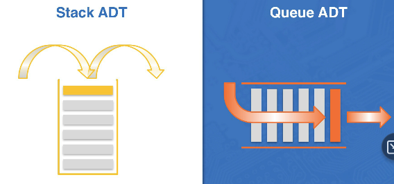
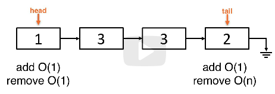
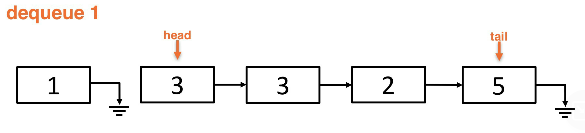
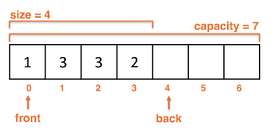
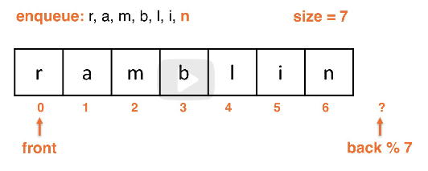
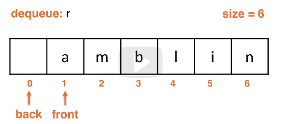
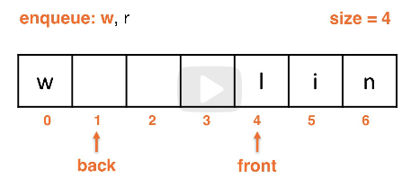
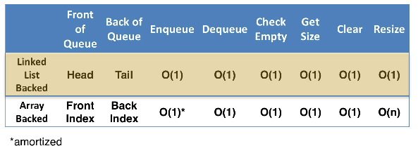

# queues adt lesson
Queues model linear data. Stacks are `LIFO` while quques are `FIFO`.

## Queue structure
A linear data model that has a first-in, first-out structure.

Example:
* Lines at a store
* Printer queue that processes print jobs in order of arrival

Queue vs. Stack structures:

## Queue supported operations
* `void enqueue(x)` - Adds data to one end of the queue (back)
* `x dequeue()` - Removes data from one end of the queue (front)
* `x peek() / x top()` - Shows the item at the top (front)
* `boolean isEmpty()` - Determines if the queue is empty
* `void clear()` - Clears the queue

## Queue unsupported operations
* Searching for data
* Arbitrary index access
* Arbitrary add or remove

## Linkedlist backed queues
* A `head` and `tail` reference are needed for the Queue because we perform on both sides
* Operations have different costs depending on which end they're performed (see below)

Operation cost comparison with Linkedlist backed Queue:

Dequeue-ing from the list:

## Comparison of linkedlist implementations
* Singlylinked list with a `tail` reference
    * enqueue at the tail and dequeue from the head
* Doublylinked list with `tail`
    * enqueue and dequeue occur at either end
        * must be the opposite end
    * Not necessary to implement a Queue, just has higher memory

## Array implementation of Queue
* Arrays are used, not Arraylists
* Wrap-around or circular array
* We must keep track of `size` and `capacity`
* We will still enqueue from the back and dequeue from the front, same as linkedlist

Array backed Queue:

* The first element enqueued into this was `1`
* The last element was `2`
* In a circular array the front and back indices wrap-around the ends of the array
    * The front index tracks the first elements, the back tracks the last element
    * `back index = last index + 1`
        * or `back index = front index + size`

The `back` behavior is mod to allow the wrap-around behavior:

The wrap-around behavior during the dequeue puts `back` at 0:

Wrap-around behavior during the enqueue puts `back` at 1:

## Queue implementation time complexity
The Big-O times for each of the Array and LinkedList backed implementations.
The `*` means amortized.

## Spatial locality when accessing elements
**Spatial locality** is a prefetch operation where data in adjacent memory locations
is retrieved prior to being used. Processors try to "predict" what will happen next
and will prefetch data to speed operations.

When using an ArrayList vs. a LinkedList for a Queue implementation it seems better
to use a LinkedList, even if O(1) is true for all of the operations in both.

However, using **spatial locality** we can potentially get better performance
outside of the Big-O statements due to the processor finding the data in a prefetch.

