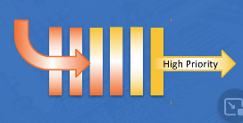
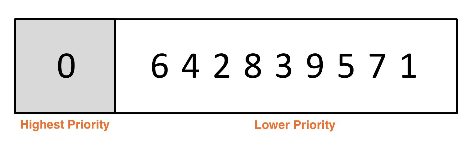

|  Title | Category  | Tags  | Date |
| ------------ | ------------ | ------------ | ----|
| priority-queues | dsa  | priority queue  | 20210618123631 |

# priority queues
Priority queues are similar to stacks and queues because they are linear.

The expected behavior is different than a regular queue.

## Priority queue ADT
* Stack ADT:
    * Remove -> Most recently added element
* Queue ADT:
    * Remove -> Least recently added element
* Priority Queue ADT:
    * Remove -> Element with the highest priority

Priority Queue diagram:

### Common uses
* Retrieve minimum values from a collection of data
* Retrieve maximum values of a data set

* Because there is a priority element the data is typically comparable
    * This allows us to distinguish between high and low priority elements

Priority Queue example:

## Priority queue implementations
**Problem** is efficiently ranking by priority.

**Solution** is utilizing heaps to solve the priority problem.

### Example use cases
* Waiting room in an emergency room
* Boarding a plane based on ticket class - first, business, coach
* In graph algorithms, minimum spanning trees. Finding the shortest path from A to B

