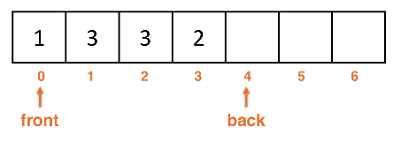
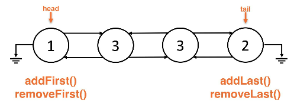

# deque adt
Dequeues support add and remove operations from either end of the data, rather
than a specialized place like Stacks and Queues.

## What is a Deque?
* Deque - a "double-ended queue"
    * Does not mean that it is searchable
* Does not have a single expected removal behavior compared to Stacks or Queues
* Can add or remove from both sides

Deque model:

## Deque supported operations
* `void addFirst(x)` - Add to the first index
* `void addLast(x)` - Add to the last index
* `x removeFirst()` - Remove from the first index
* `x removeLast()` - Remove from the last index
* `boolean isEmpty()` - Check if the Deque is empty
* `int size()` - Return the size

## Deque unsupported operations
* Searching for data
* Arbitrary index access
* Arbitrary adding/removing at indexes

## Array backed Deques
* Use a circular, wrap-around array implementation

### Array backed methods
* `addLast()` - increment back (mod by capcacity)
    * Add to back
* `removeLast()` - remove at back -> decrement back
    * (check if < 0) because we can't go to -1 to wrap around the front
        * If we're in the negative we have to set the marker (`front` or `back`) we set this to the `size`
    * the `%` (mod) behaves differently with negative numbers in java
* Implementation would be in O(1) for these operations
    * Add and remove would be amortized O(1)\* due to the resizing that may occur

Array backed Deque:

## Linked list backed Deques
* We use a doubly linked list because singly would be very inefficient
* `addFirst()` and `removeFirst()` are both done at the `head`
* `addLast()` and `removeLast()` are both done at the `tail`

Linked list Deque:

### Linkedlist backed methods
* `addFirst()` - add to the `head`
* `addLast()` - add to the `tail`
* `removeFirst()` - remove from the `head`
* `removeLast()` - remove from the `tail`
* All of these operations have O(1) time complexity

## Examples
* Online purchasing systems
    * Enqueue to the front during purchasing
    * Dequeue when the purchase completes
    * Customer can enqueue to the front of the deck again if they need to make changes to their purchase

