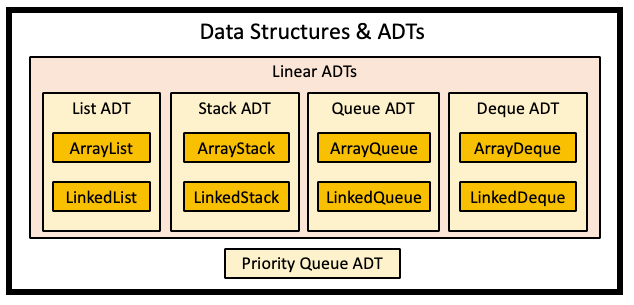
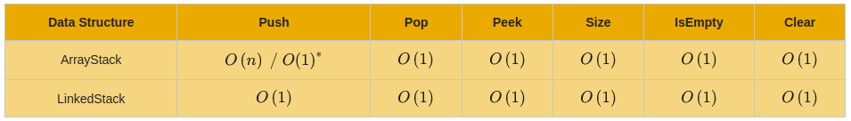
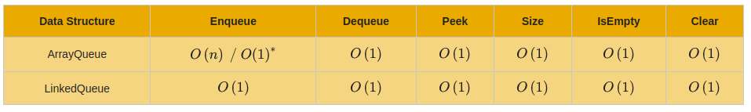
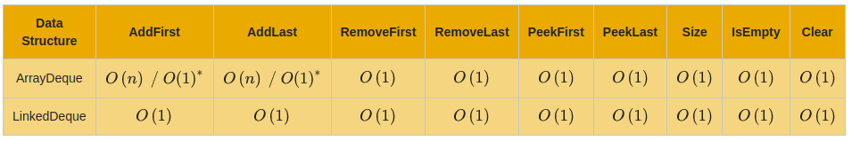

# review linear abstract data types
The current list of data structures covered with implementations. The only
implementation missing is the Priority Queue ADT, as this would be better in a
non-linear approach.

Current ADTs:

## Time complexity (big-o) review
The `*` denotes an amortized big-o analysis being used.

### ArrayStack and LinkedStack

### ArrayQueues and LinkedQueues

### ArrayDeques and LinkedDeques

