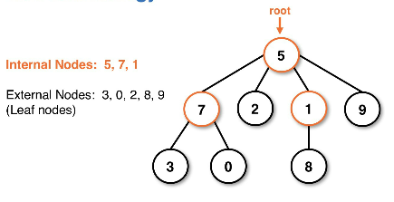
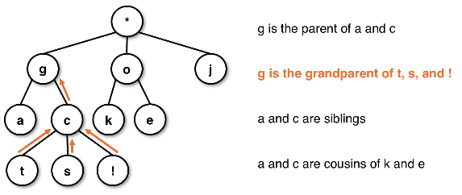
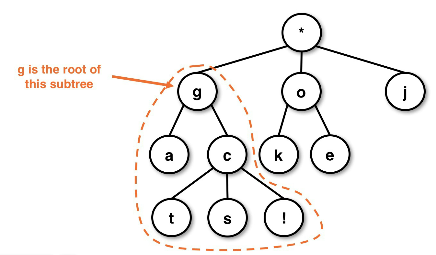
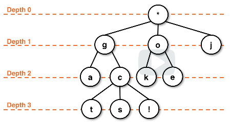
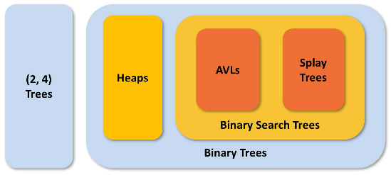

# tree structures
**Trees** are a gateway concept toward efficient search procedures.

## Previous structures
* All previous list-based ADTs are not efficient for searching
    * When looking at a linkedlist or arraylist we have to traverse in O(n)
* Similarly, Deques, Queues, and Stacks are limited in their operations

## Tree ADT
* Conceptually, a tree is a linked structure where each node has a parent-child relationship
    * Linkedlists are technically trees, just simple ones
* A node has a **single parent** but can have **multiple children**
* **Trees** - connected linked structures with no cycles
    * A **cycle** would be like a circularly linked list, where you can loop to the head
    * Can be implemented in a variety of ways, depending on the details of the type of tree
        * Most commonly we use linkedlist structures with `Nodes` and `pointers`

Tree diagram example:

Root of the tree:

### Terminology
* **root** - the top node (a node with no parents)
* **internal node (parent)** - a node with children
* **external node (leaf)** - a node with no children
* **cousin nodes** are of the same "generation" but with different parent nodes
* **relative position** is the depth that the node resides at, this is used to classify

Tree root relationship diagram:

Subtrees are children of the `root` node:

Node depth for relative position classification:

## General concepts
* Think of each of the child nodes under the root as their own sub tree
    * This is important to remember during the recursive operations used to traverse
* Valid subtrees can be `null` or even single, one-elemnt node trees
* Relative positions within the hierarchy care used as both a classification and reference
    * Depth refers to the distance from the `root` node
    * The height of any leaf node is always `0` and is generally easiest from the leafs up
        * This would be a bottom-up approach
    * `Height(node) = (Max. child height) + 1`
    * `Height(leaf) = 0`
* Operations for the tree ADT are similar to other structures
    * `add` and `remove` methods
    * Query methods like `get` and `contains`
    * Accessor methods like `size` and `isEmpty`
* There is no concept of **front and back** like in linear models

### Properties
* **Shape** - What is the structure of the nodes in the tree?
    * Structure of the tree
* **Order** - How is the data arranged in the tree?
    * How the data is arranged inside the structure

### Classification of trees
* Trees can be either a data structure or ADT depending on the language
* Below are groupings of tree types

Tree structure classifications:

