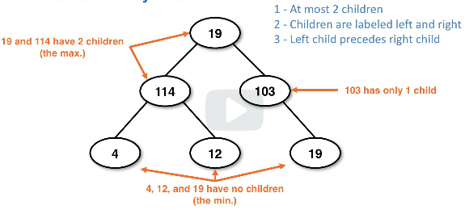
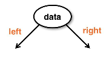
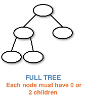
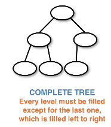
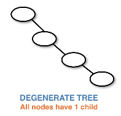
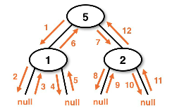

# binary trees bst
**Binary trees** are a tree that has a shape restriction, nodes can have at most *two children*.

**Binary Search Trees (BST)** are binary trees with an imposed order property.

## Properties
The binary tree properties required to adhere to this classification:
1. At most 2 children per node
1. Children are labeled left and right
1. Left child precedes right child

Example binary tree with definition and labels:





### Node information
* `data` and pointers to the `left` and `right` node
* Other potential node information:
   * Parent reference
   * Depth
   * Height
* Information varies based on the need of the shape and type of the tree

Example `Node` diagram:





## Shape properties for binary trees
A tree is considered to be **full**:
* Every node except for the leaves has 2 children
    * Every node should have either 0 or 2 child nodes

An example **Full Tree**:





A tree is considered to be **complete**:
* If all of the levels are completely filled except for **the bottommost level**
    * The bottom level of leaf nodes is filled in left-to-right, with no gaps between nodes
* When trees are complete they are easier to *back with a raise*

An example **Complete Tree**:





A tree is considered to be **degenerate**:
* If all nodes only have one child reference, except for the leaf which has no children
    * This is considered the worst binary tree, it is basically a linked list
    * With this we don't have nice traversal, we're stuck with O(n)

An example **Degenerate Tree**:





## Nodes
* References to other child nodes
* Can reference an actual node or `null`
    * Some implementations do use dummy nodes

## Iterating through a binary tree
To iterate we use a recursive method to traverse until we find a null node
* The below implementation does not use a parent reference, which frees memory
* Once we return from the recursive call we're back at the same point in the call from its parent

```java
// We can traverse on each side until finding null
// this doesn't require a parent reference
// which frees memory
public void traverse(Node node) {
    if (node != null) {
        traverse(node.left)
        traverse(node.right)
    }
}
```

An example traversal pattern using recursion:




