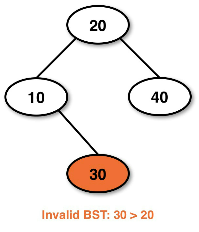

# binary search tree (bst)
A type of binary tree with the same properties but enforce a data order property.

## Properties
A binary search tree enforces order:
* The left child data is less than the parent data
* The parent data is less than the right child's data
* All of the data on the left sub tree must be less than the data in the parent node
* All data in the right sub tree must be more than the node

Example of a valid BST:

Invalid BST example:

## Implementing and efficiency of BSTs
* In Java the data in a BST must implement the `Comparable` interface
    * This must have the `compareTo` method
* **Motivation** for binary search
    * Each comparison tells you the data is to the left or the right
    * We have to search half the data, rather than all of it
    * This is an O(logn) runtime
* Performance depends on the shape of the tree
    * Time complexity for a **degenerate** tree (aka a linkedlist) is O(n)

## Traversals
Traversals are categorized into two groups, depth and breadth searches.

### Depth traversals (stack based)
**Depth** searches travel down the tree, like going down a rabbit hole.
These follow a path or branch as deep as it can go until it reaches a null child.

Examples:
* Preorder traversal
* Inorder traversal
* Postorder traversal

### Breadth traversal (queue based)
Breadth searches travel one level at a time, these explore one step away from
the root, then two steps away, etc.

Example:
* Levelorder traversal

