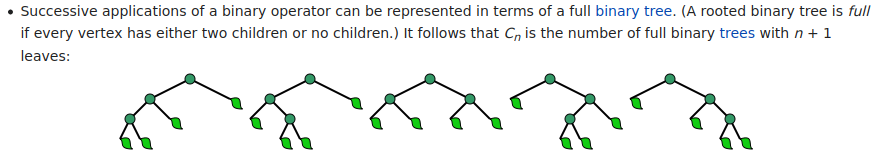

# how many BSTs from n elements
When determining the number of BSTs that can be formed from "n" elements we use
the Catalan number.

Given "n" elements, the number of BSTs possible is the Catalan number.

Catalan numbers are a recursive cocunting sequence for ordered operations.

[Wikipedia entry for Catalan numbers](https://en.wikipedia.org/wiki/Catalan_number)

Formula for C<sub>n</sub>:
```
Cn = (2n)!/((n+1)!n!) for n >= 0
```

Binary tree excerpt:





## Binary Tree calculation
Because binary trees don't have to uphold the same sorted order we get a larger number.

Given "n" elements:
```
Catalan number * n! = # of possibilities
```
