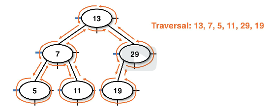
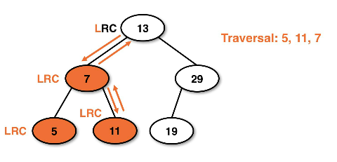
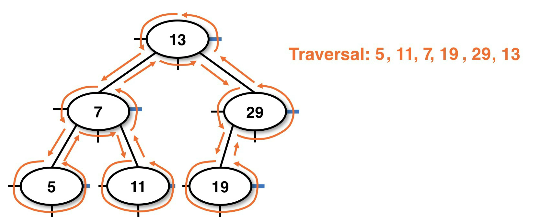
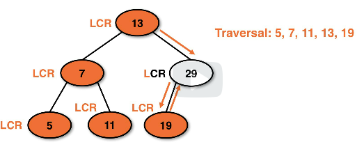
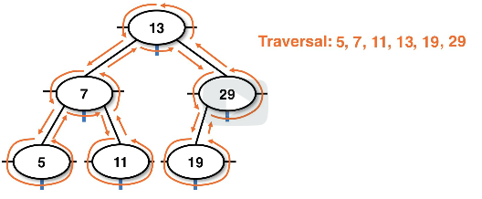

# depth recursive traversals
Each binary search tree traversal is a variation of some recursive strategy.

These all recursively crawl each path, the only difference is the order that
operations are performed.

This does essentially the same function as `Iterable`/`Iterator` does in java.
The primary difference is the ordering of the same actions.

## Preorder traversal
This is useful for situations where we want to make an **exact copy** of the BST
using data in the same order presented.
* This does a "center" -> "left" -> "right" traversal of nodes, going on children then the parent nodes

We can make copies of the BST using the BST preorder traversal that mirrors
the actual defining structure of the BST.

Preorder recursive pseudocode:
```
preorder(Node node);
    if node is not null:
        look at the data in the node
        recurse left child node
        recurse righ child node
```
* Looking at the data can mean printing, recording, or performing a task

Example recursive tracing using preorder:


* Note: CLR means "current, left right"


Example tracing of BST showing the traversal:



* Note: This is the same structure as the BST and can be used to clone it

## Postorder traversal
This shares similar properties that preorder traversal has. This identifies
the BST as well.
* This might be implemented with a structure to store a list of the data
    * This would record the left most, then right most data, then center for nodes
    * The root would be recorded last
* Postorder recursion is useful for removing data
    * Typically in BSTs data is removed from the leaves, this would be checking leaves first
* This does a "left" -> "right" -> "center" traversal of nodes, going on children then parent

* **Note**: This cannot be performed on a binary tree. This *must* be performed on a BST

Postorder recursive pseudocode:
```
postorder(Node node);
    if node is not null:
        recurse left child node
        recurse right child node
        look at the data in node
```

Example postorder recursive tracing:



* Note: LRC means "left, right, current"


Example postorder recursive path:




## Inorder traversal
This is unique for BSTs because it yields the data in a sorted order.
* We can use this for returning a sorted list of the data in a BST
* Structures can be used to store the data
* This does a "left" -> "center" -> "right" node traversal going in sorted order
* The inorder traversal is only true for structures that have a left < center < right order

Inorder traversal recursive pseudocode:
```
inorder(Node node):
    if node is not null:
        recurse left child node
        look at the data in node
        recurse right child node
```

Example inorder traversal tracing:



* Note: LCR means "left, current, right"


Example inorder recursive path:




