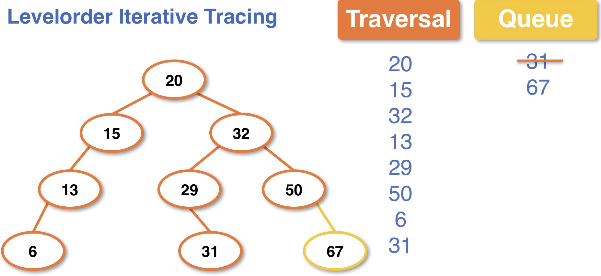

# breadth iterative traversals
**Levelorder** traversal gets all data in the order that it appears *within each level* on the BST.

We do not use recursion, but rather a Queue and a `while loop`.

Example Levelorder traversal pseudocode:
```
levelorder():
    Create Queue q
    Add root to q
    while q is not empty:
        Node curr = q.dequeue()
        if curr is not null:
            q.enqueue(curr.left)
            q.enqueue(curr.right)
```

* When working through a traversal using levelorder we will likely keep a list of the data as it is traversed
    * This data is pulled from the Queue structure as they get added on each traversal call

Example levelorder tracing:




