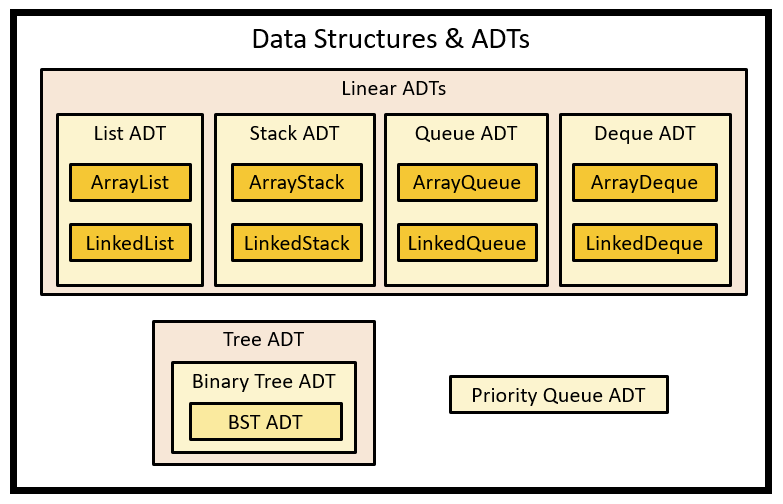

# trees review
The Tree ADT worked through the Binary Tree ADT and BST ADT.

The current data structures and ADTs up to this point:

## Big-o review
The big-o for this module was not particularly discussed; however, all traversals
are O(n) because we go through each data point.

Additionally, calculating the height or max depth of a tree is O(n) as well. This
would also require going through the entirety of the structure

