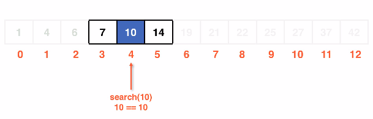
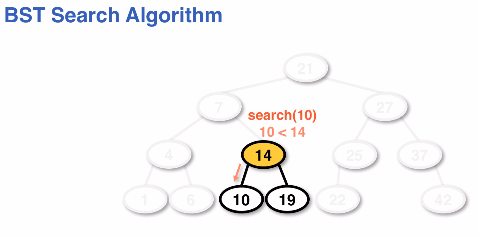

# searching in a bst
Linear data structures have O(n) time complexity for searching for data.
Binary search trees aim to better optimize searching in O(logn) time.

We work through this by subdividing the subset of data we are examining
during searching.

## Binary search algorithm
Binary search algorithms allow us to sift through a sorted data set in O(logn)
rather than linear time like O(n).
* Note: Searching a degenerate list is O(n) because it is basically a linkedlist.
* Note: Searching and finding the data at the root is a best-case scenario of O(1)

**Termination cases**:
1. Data is found
    1. We terminate and return the data
1. Data is not found and the list is subdivided until a `0` case is reached
    1. We terminate and return null

### Array example
When working through searching in an array we would use the *median* of the array.
This subdivides us on each comparison into 1/2 of our data per condition statement.

Binary search in an array:

### BST search
Searching in a BST would use comparisons using the root node and each subsequent
node, rather than using a "median" approach.

We would compare the target data and create "sub trees" on each iteration.

BST search algorithm showing sub trees:

