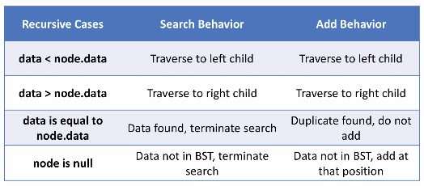

# adding to a bst
Adding to a BST has similarities to searching; however, if we need to restructure
the tree it will be a bit harder than doing a search.

## BST search vs. add
The methods for searching and adding are both recursive methods that will search for data
via traversal.
* To maintain the structure of a BST we have to add only as leaf nodes
    * Insertion into the middle of a tree is very difficult and has no real way to reconcile the structure
* Note: Adding data to an empty tree puts data in at the root
* Data is added at null values so long as it is not already a node

BST search vs add chart:





Adding nodes to a BST example:


* The above example utilizes a recursive search to check each node

## Changing the tree structure
When implementing the add method we use **pointer reinforcement**.
* Adding a node changes the parent node's left or right pointers, not the node that is being added or removed


* **pointer reinforcement** - For each call use the return field to restructure the tree
    * Return the node that should be in the direction of traversal
        * If you traverse left, return what should be the left child
        * If you traverse right, return what should be the right child
    * Set left/right pointer to what is returned
    * This changes the restructuring to the recursive call of the parent rather than the child
* **lookahead method** - The recursion is done at one level ahead by keeping track of the parent node rather than the node being added or removed
    * This never actually reaches a null node
    * It just checks to see if the child in the direction to travel is known or null
    * Example: If a child is null, then we can add there
    * Works for simple restructuring operations like add, for more complex structures this becomes difficult

Adding to a BST diagram:


### Pointer reinforcement
The `add()` method for a BST using pointer reinforcement is a public wrapper
method that implements a private method. This is used to keep the method from
being changed.

The recursive method checks for 3 cases:
1. If the cursor is null
1. If the data is less than the current data (go left)
1. If the data is greater than the current data (go right)

* Node: When exiting the helpe rmethod once a node is added we return the current node at the end
    * This reinforces the pointers that were not changed once the new node is added

Pseudocode for `add()`:
```
public void add(int data):
    root <- rAdd(root, data)

private node rAdd(Node curr, int data):
    if curr == null:
        size++
        return new Node(data)
    else if data < curr.data:
        curr.left <- rAdd(curr.left, data)
    else if data > curr.data:
        curr.right <- rAdd(curr.right, data)
    return curr
```

