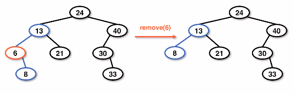

# removing from a bst
The removal method from a BST is one of the hardest operations to implement.
This is similar to the search algorithm where it has to find the element itself,
rather than a lookahead or other implementation.

There are several cases that need to be handled:
1. `data < node.data`
1. `data > node.data`
1. `data == node.data`
1. `node is null`

Binary search tree removal recursion cases:


## Removal of a node
Removal cases are handled in different ways, depending on the children that is has.

### Zero children case
If the node has zero children (0) then we can set the `right` or `left` child node
pointers of the parent to `null`.

This would not disrupt the structure of the tree at all.

Example zero-child case:


### Single child case
When a node has one child we will need to skip the node to be removed and set
the parent's pointer to be that of the child's child.

This would not disrupt the structure of the tree so long as we reset the pointer.

Example single-child case:




### Two child case
The removal of a node with two children requires a more significant upheaval
of the tree structure because this node is considered "more prominent".

This is accomplished by copying the data from lower children to nodes that are
higher and in a "more prominent" position.

When removing the data itself we are left with determining which node now becomes
the defacto parent.
1. **predecessor** - the next largest element that is smaller than the data we want to remove
    1. We traverse 1 reference to the left and one reference to the right to retrieve a predecessor node
1. **successor** - the next largest element, the node to the right of the removed node with a left `null` child
    1. This would be retrieved with 1 traversal to the right of the removed node and one traverse to the left until we find a left `null` child

* Note: If a successor or predecessor has 2 children then it is not a "true" predecessor/successor.


Example **predecessor** node in a BST removal:


Example **successor** node in a BST removal:


#### Two child removal case results
The results of a two child removal have two different opportunities: either a
successor or predecessor rooted tree.

Example of both trees that are possible when removing the predecessor/successor
node:


## Removal pseudocode
The removal within a BST relies on a wrapper method to pass the removed data back
through the recursive stack.

Example pseudocode for BST removal method:
```
public int remove(int data):
    Node dummy <- new Node(-1)
    root <- rRemove(root, data, dummy)
    return dummy.data

private Node rRemove(Node curr, int data, Node dummy):
    if curr == null:
        // data not found case
    else if data < curr.data:
        curr.left <- rRemove(curr.left, data, dummy)
    else if data > curr.data:
        curr.right <- rRemove(curr.right, data, dummy)
    else:
        // data found case
    return curr
```

Example pseudocode for data found case:
```
dummy.data <- curr.data
decrement size
if 0 children:
    return null
else if left child is non-null:
    return left child
else if right child is non-null:
    return right child
else:
    Node dummy2 <- new Node(-1)
    curr.right <- removeSuccessor(curr.right, dummy2)
    curr.data <- dummy2.data
```

