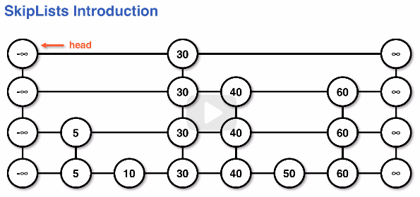
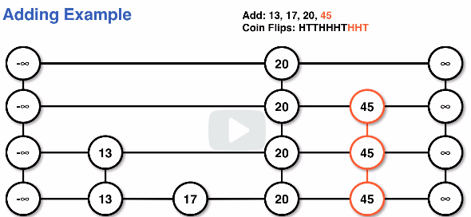
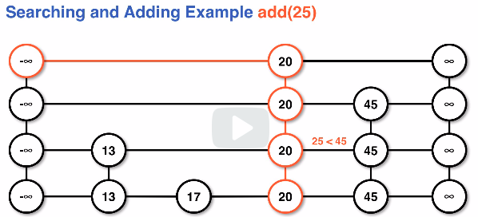
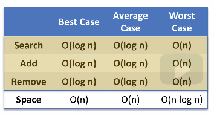

# skiplists
The skiplist is a similar data structure to the BST, in that it solves a searching problem.

The sorted structure is maintained but the lvels are created using probability.

## SkipList structure
* The skiplist structure is similar to a series of "levels" of linkedlists.
* Skiplists typically have a data pointer and a left, right, up, and down pointer
    * Sometimes skiplists are implemented with just right and down pointers
* Skiplist levels:
    * Each level has a negative infinity assigned to the `head` of the linkedlist
    * Each level has a positive infinity assigned to the `tail` of the linkedlist
    * The linkedlist is sorted in descending order at each level
    * Each level has some subset of the data from the level directly below
    * The lowest levels, `0`, contains all of the data in the skiplist
    * Elements in the skiplist can exist on more than 1 higher level if they're promoted upon adding

SkipList structure example diagram:

## Use of probability
* Number of times a node is duplicated depennds on coin flips
    * Heads promotes a node, tails terminates promotion in adding
* Probability of a node reaching level **i** is **(1/2)^i**

Examples:
**T** would promote 0 times, giving 1 node
**HT** would promote 1 time, giving 2 nodes
**HHT** would promote 2 times, giving 3 nodes

### Expected number of levels
Due to the probability based distribution of nodes we know all data is on level 0,
with half of the data promoting up at each subsequent level.

This distribution defines the space and time complexity in skiplists.

* Note: On avreage we would have `log(n)` number of levels (layers) in a skiplist
    * Most implementations require a cap of log(n) levels
    * Capping the levels keeps us from promoting a ridiculous number of times (unlikely but possible)

Example of adding nodes to a skiplist:

## Searching algorithm
The goal of the skiplist is to skip through data during searching.

Because we are looking for data starting at the top left (negative infinity)
node, we will always find the highest level of the data we want.

General notes on the algorithm for search:
1. begin the search at the head, the top left infinity node
1. look at the right node if it exists and compare with data
    1. `if data < right`, continue moving right
    1. `if data > right`, go down a level
    1. `if data == right`, data has been found
    * Repeat until the data on the right is either found or `null`
**If adding to the skiplist**
1. If at the bottom level, data isn't in the skiplist
    1. for adding, this means that we've found where to add

Example of adding to a skiplist and searching for the position:

## Efficiency of skiplists
The skiplist efficiency is dictated by the distribution of the data.

The best or average case the skiplist will adhere to the distribution of 1/2
the data on level 1, 1/4 on level 2, etc.

This adheres to a regular distribution, yielding O(logn) complexity for all three operations
(add, search, remove).

Worst case scenarios yield an O(n) time for the add, search, remove operations if
we have a poor distribution (aka, when all data is on level 0).

The average space complexity for skiplists is O(n) because it is a geometric series.
    * The worst case scenario is all data being promoted and yielding a massive grid, O(nlogn)

Efficiency table of skiplists:

## The purpose of a skiplist
Skiplists seem strange and don't really yield much in the way of immediate use cases
like a Stack or Queue would.

1. Skiplists can be useful for simple concurrent access operations.
    * Two users working with the same data structure simultaneously.
    * In a BST if a user removed data while another was searching it would mess them up.
1. Skiplists are simple to implement
    * Multiple variations of BSTs have to have a balancing scheme to help search times
        * These balancing schemes can be tricky to implement, whereas a skiplist is simpler to make and understand
    * The worst case behavior is similar to BSTs but the reliance on probability can often allow it to perform comparably
1. Skiplists are a nice intro to randomization
    * This is an introduction to randomization that doesn't require heavy use of math

