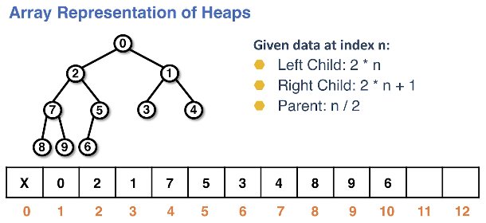

# binary heaps
Binary heaps are the most common form of **heap** structure. There are more types;
however, often times when discussing a heap it will be a binary heap.

Heaps are another binary tree type with an additional property **completeness**.

This property lends itself to an array implementation which is typically faster
at a low-level when compared to a tree node implementation.

Heaps have a different order property than BSTs. This order property changes
how we look at things like add/remove operations.

## Heap characteristics
Heaps are a binary tree, but *not* a binary search tree.
* Have the shape property of a binary tree, every node can have at most **two children**
* Must be complete (see below screenshot)
    * This is easy to implement with an array
* Order properties of the heap characterize the type:
    * **min heap** - the smallest element in the data set is the root
        * The data in the children are larger than the data in the parent
        * There is no direct relationship between the siblings or two children
        * The data in every parent is smaller than it's children
    * **max heap** - the largest element in the data set is the root
        * The data in the children are smaller than the data in the parent
        * There is no direct relationship between the siblings or two children
        * The data in every parent is larger than it's children
* When implementing a heap with a **backing array** we begin the indexing at index 1, omitting index 0

Example of complete and incomplete trees:

Min heap example:

Max heap example:

### Array representation of heaps
The data is placed in a heap based on a level order traversal.

The min heap is illustrated within the array, wherein the backing array has no
gaps and is complete. This allows us to:
* Compute the indexes of a parent and its children
* The backing array will not have gaps
* Given a node `n` we can easily find the left and right children

Finding children given an index `n`:
* Left child: `2 * n`
* Right child: `2 * n + 1`
* Parent: `n / 2`

Array representation of heaps:

## Heap use cases
* Designed for accessing the root
* Not designed for arbitrary searching
    * No better than searching in an ArrayList: O(n)
* Often used to back a priority queue
    * This is because they always keep the largest or smallest item at the root, O(1)
    * Ex: Emergency room waitlist

