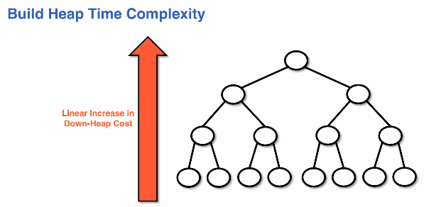
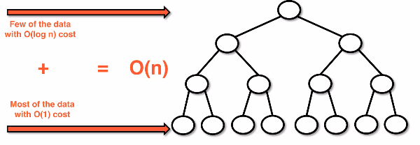
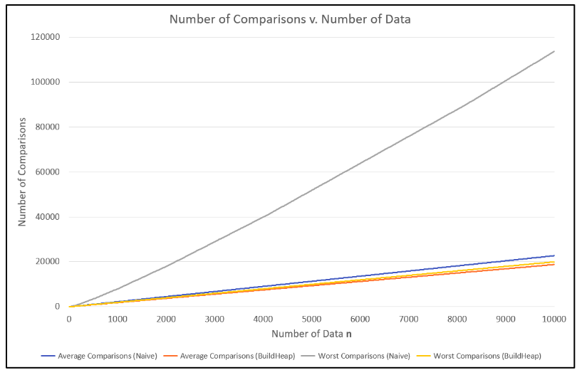

# buildheap algorithm
The buildheap algorithm constructs a heap in linear time. This is an improvement
over the naive implementation of adding one elemnt at a time in O(nlog(n)).

The idea uses a buildheap subroutine quite heavily from the remove operation.

## Problem description
* **input** - unsorted, unordered array
* **problem** - construct a heao from the input
* **possible solution** - use the add method to add all data to an empty heap one by one
    * adding to a heap is O(log(n))
    * we add to the heap n times
    * this solution is O(nlog(n))
    * this would be improved with an alternative approach

## Validity of down-heap
If we have valid sub-heaps as children we can take advantage of the down-heap
by understanding that we can down-heap into valid sub trees.

## Buildheap algorithm
Build heap properties:
* shape property - put the data in as presented
* order property:
    * look at sub-heaps
    * down-heap through valid subheaps
* Ensuring that the shape property is enforced and using down-heaps can reduce our construction time
* Building needs to be done from the bottom up

* Note: We iterate through the index using `n / 2` where `n` is the size
    * This allows us to reduce the number of down-heap operations by avoiding looking at children
    * A down-heap helper method should be implemented generally for any index so it can be reused

## Buildheap algorithm efficiency
* Down-heap is O(logn)
* Building a downheap does n/2 operations
* The build-heap algorithm is O(n)

Linear increase in down-heap cost:

Cost differences in down-heap costs:

Number of comparisons v. number of data in down-heaps:

