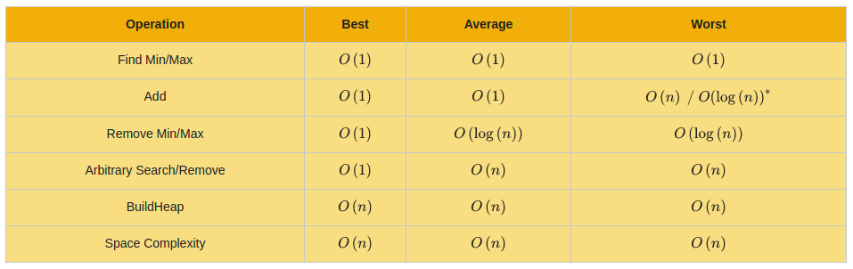

# heap review
The current list of ADTs and data structures ar ebelow. Adding heaps finishes
the priority queue ADT.

Current data structures and ADTs:

## Big-o for heaps
Heaps are pretty efficient, remember that amortized analysis is noted with a `*`.

Big-o review for heaps:

