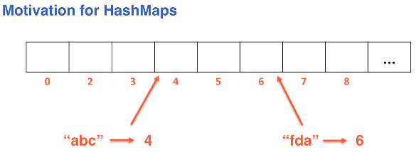
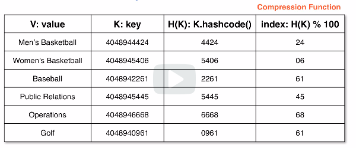

# map set adt
Maps and Sets are the backing of HashMaps - one of the most useful data strucutre
in CS.

## Maps
The following are characteristics of maps. This structure can store and retrieve
data based on keys. These keys are unique identifiers that cannot be changed.
Changing keys would impact our ability to search, which is why they are **immutable**.

Key points:
* Collections of key-value pairs
    * `<K, V>` -> `<Key, Value>`
* Searchable
* Unordered (when used with hashing)

Example: Phone numbers and names. The "key" is the phone number while the name is a "value".

### Backing structure
Arrays are the standard hashmap backing structure. These are typically called a
**backing table**.

Prime numbers are generally chosen for the backing length to avoid limit collisions
during compression.

#### Hash function
This represents our key object as an integer value (hashcode)
* Maps the hashcode to an integer in the backing array
* `If A.equals(B) -> A.hashcode() == B.hashcode()`
* `If A.hashcode() == B.hashcode()` we CAN'T assume `A.equals(B)`

#### Verbiage
* The mapping of a key to an integer is done via a **hashfunction**
* The result of applying a hashfunction to a key is a **hashcode**

* Note: In Java **hashmap** and **hashtable** mean two different things.

### Methods
* `V put(<K, v>)` - takes in an entry
    * Will add the entry to the map or replace an existing entry's value
        * If a value is replaced it will return the old value
        * If a new entry is added it returns null
* `V get(<K>)` - takes in a key and returns the value `V`
* `V remove(K)` - takes in a key and returns the removed value
* `Set<K> keySet()` - returns a set of all the keys in the map
* `List<V> values()` - returns a list of all values in the map
    * Ordering is ignored
* **size** - number of entries, n
* **capacity** - the size of the backing array

### Motivation for hashmaps
We want to access a specific value using search in O(1).

Arrays allow indexes to be accessed in O(1) time, so this takes advantage of that property.

Showing access of hashmap in an array:

## Hash functions and compression
When working with hash functions and compression we need to keep the data in a smaller
backing array. The key is parsed using a `hashcode()` to reduce the size then compressed
to fit within the backing array.

Example:
Department store items with a key value. This key is `hashcode()` to return the last 4
digits of the key. Then, to compress further we mod the key by the backing array size.

### Collisions
**Collisions** are when you have a hashed, compressed index value that *returns the same index value* as another record.

In a practical sesne we will always have collisions. Even with a perfect hashfunction
mapping keys to integers we still don't hav einfinite memory.

There is no real reason to have an array of length in millions if we only store
ten pairs in it.

### Avoiding collisions
Collisions affect our ability to search.

* Resize to a larger table
    * `newCapacity = (2 * currCapacity) + 1`
    * This reduces the number of collisions
    * Do not wait until the backing structure is *entirely full*
* Resize when the maximum load factor is hit
    * `load factor = size / capacity = n/N`
    * Typical maximum load factor: 60-70%
* Use of prime numbers for the capacity
    * Minimizes the collisions when data exhibits some particular patterns

## Sets
This is the same as a Map except we only have keys, our data has no values.

This is similar to the concept of a set in math, except that sets are typed to hold
only one type of data. Similarly, we can sometimes hear people say the term dictionary refer to a map.
This is common in Python, where dictionary refers to the map.

Similar to other data structures like BSTs we can think of them as implementing the Set ADT or
Map ADT. If we search in a BST to check for membership of data then it's a Set.

If we look up an identifier tied to other data (user record) then it's a Map.

