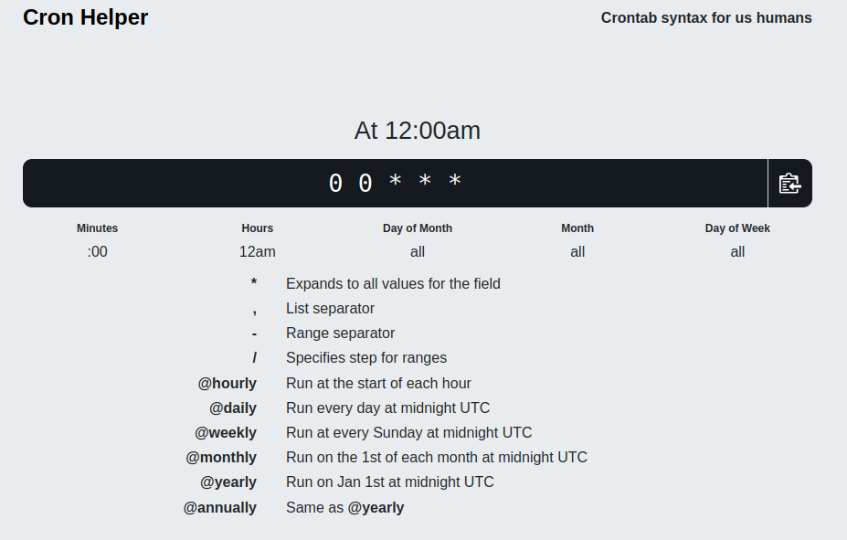

# cron job website
I wanted to keep track of this nice Cron scheduling site. I don't like to memorize
commit brain power to memorizing lots of syntax, so this was very nice to come across.

[Cron Helper](https://cron.help/)

Screenshot of the site for an "everyday at midnight":

