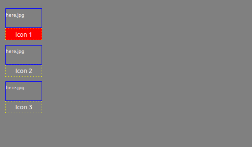
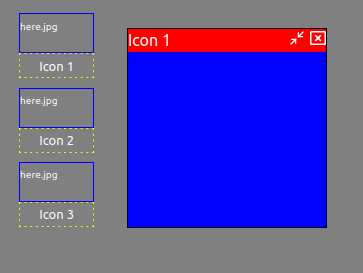

# react double click functionality
Double click functionality was a necessity in a "desktop" style UI that I decided
to emulate. This project needed to highlight a specific React component when
it was single clicked or "open" a hidden component on double click.

[Source for code inspiration](https://stackoverflow.com/a/65088045/12387496)

This `Icon` component that I was creating would enable the user to click 1 time
to highlight the "name" of the icon or twice to remove a `hidden` modifier class
on another component.

This is a single click highlighting in red:



And the double click would "bring up" this component while removing the red highlight:



Some example code for this:
**Note:** I've placed the actual rendering state handler in a parent component "controller".

```javascript

  // source: https://stackoverflow.com/a/65088045/12387496
  onClickHandler = (event) => {
    clearTimeout(timer);
    if (event.detail === 1) {
      timer = setTimeout(this.onClick(event), 200)
    } else if (event.detail === 2) {
      this.onDoubleClick(event)
    }
  }

  onClick(event) {
    const currentState = this.state.selected
    if (currentState === event.target.id) {
      this.setState({ selected: ""})
    } else {
      this.setState({ selected: event.target.id})
    }
  }

  onDoubleClick(event) {
    this.setState({ selected: "" })
    this.props.onDoubleClickRender(event)
  }

```

