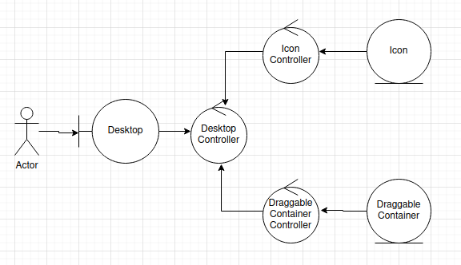

# creating a controller structure in react
State management within components is relatively easy to accomplish; however,
having something akin to a parent-child-cousin relationship requires some trickier
React component structuring.

I needed to accomplish some interesting interactions with state management that
would ensure:
1. Rendering would happen only once to start for each component
    1. Re-rendering would only happen when I made changes to child state
1. The components could talk to each other to change the state of one another
1. There was a centralized orchestration that was easy to manage

Below is a diagram of the general layout that I wanted to accomplish. This is
a similar functionality to MVC within OOP.

I was able to accomplish this with the 6 components in the above diagram:
1. Desktop - The interactable area rendered for users
1. Desktop Controller - The state management for sub-components that directly implements the content
1. Icon Controller - The state manager and rendering agent for Icon components
    1. Icon - A main interactable component
1. DraggableContainerController - The state manager and rendering agent for DraggableContainer components
    1. DraggableContainer - A main interactable component

