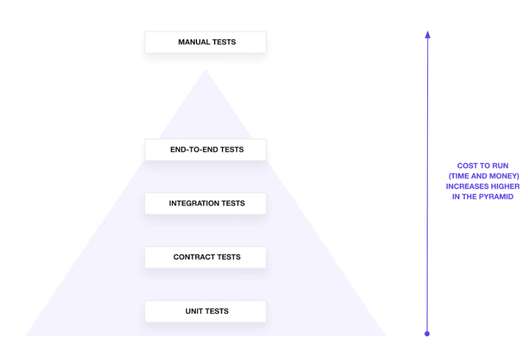
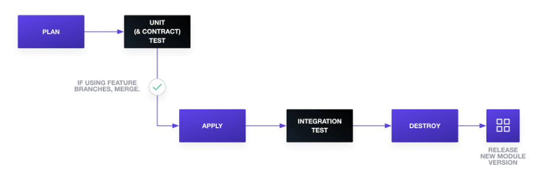

# terraform best practices notes
The project I'm currently working on with my friend works as a Terraform wrapper
to provide prebuilt database modules. The idea is that we'll provide tuned databases
to be used in projects via Terraform.

In order to provide a robust interface I'm writing down the best practices discovered
in my research phase of the project. This ensures I have a central place for the
information I'll incorporate into the project plan.

### References
* [Testing HashiCorp Terraform](https://www.hashicorp.com/blog/testing-hashicorp-terraform) - Resources on testing
TF modules
* [Developing TF modules at scale](https://www.slideshare.net/TomStraub5/developing-terraform-modules-at-scale-hashitalks-2021) - A
pattern for developing TF modules
* [TFTest](https://github.com/GoogleCloudPlatform/terraform-python-testing-helper/) - Testing framework in Python


## Testing TF modules
We can test the configuration of modules with `terraform validate` and `terraform plan`,
but this is likely not enough to ensure that the module is properly going to catch errors
and not fail when applying changes to production infrastructure.

Example testing pyramid that groups tests by type, scope, and granularity. The higher
up this pyramid we are, the fewer tests we should have.




### Unit tests
Rudamentary unit testing ensures "does my config or plan contain the correct metadata".
These tests should be run independently of the app integration without external resources/API calls.

A quick validation/unit test could be:
```
terraform fmt -check
terraform validate
```

The above ensures that we have the proper HCL/JSON and checks for static parameters
(like provider attributes). However, this doesn't validate variable interpolation,
list iterations, and other configurations.

**We can use our Python tooling to create a testing framework for Terraform plan outputs
to validate that our settings are being configured the way we expect.**

### Contract tests
Contract tests check that a config using a TF module passes properly formatted inputs. These
ensure the "does the expected input to the module match what I should pass to it?"
question is true.

The same testing framework for unit tests can be used here to ensure the right inputs
are passed to the module.

We could also use a [custom validation rule](https://www.terraform.io/docs/language/values/variables.html#custom-validation-rules)
to check that the values are proper. Refer also to [input variable validation](https://www.terraform.io/language/expressions/custom-conditions#input-variable-validation)
for more information.

These go hand-in-hand with [custom object structures](https://www.terraform.io/docs/language/expressions/type-constraints.html#structural-types)
in TF. Ensuring that the types passed to variable objects are proper.

Example validation rule:
```
variable "listener_rule_priority" {
 type        = number
 default     = 1
 description = "Priority of listener rule between 1 to 50000"
 validation {
   condition     = var.listener_rule_priority > 0 && var.listener_rule_priority < 50000
   error_message = "The priority of listener_rule must be between 1 to 50000."
 }
}
```

### Integration tests
Writing integration tests will likely require deploying test infrastructure
then destroying it as part of the testing process after validation has occurred.

An example [repository with testing infrastructure for an API](https://github.com/mehd-io/cloudrun-terraform-tftest-demo)
is a good example of using the [tftest package from Google](https://github.com/GoogleCloudPlatform/terraform-python-testing-helper/).
This package allows us to use Pytest and a Terraform wrapper to execute
tests.

### End-to-end testing
End-to-end testing would imply that we would deploy a prod resource then check
that we are able to connect to it then run things against it.

The idea of this would be that we can create a resource, do some work, then destroy it.

### Overview of testing
Testing should be done in stages, ensuring that at each stage we're working through a
reasonable approach for determining that infrastructure is working as intended.

Example photo of the testing methodology without end-to-end testing:



## Module creation
Terraform module creation patterns are a great way to ensure that there is consistency
accross the entire project. This [talk gives a good pattern for creating large
amounts of TF modules with versioning](https://www.slideshare.net/TomStraub5/developing-terraform-modules-at-scale-hashitalks-2021)

