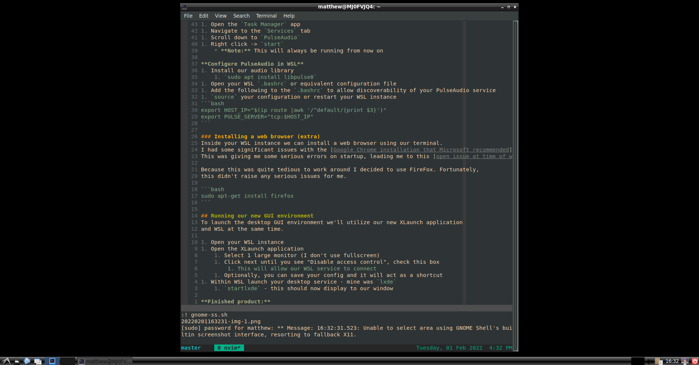

# wsl2 getting to a usable desktop environment
Windows Subsystem for Linux is supposedly a great alternative to having a native
Linux environment for those working in a Windows/MacOS development shop.

I chose to pursue this to avoid having to develop natively in Windows (or worse,
reliving my time working in MacOS).

The initial setup was fine; however, I was immediately limited by the lack of a
GUI interface when using my development tooling. My issues weren't rooted directly
in needing a point-and-click interface, but rather that I was unable to utilize
a fan-favorite screenshotting tool [gnome-screenshot](https://help.gnome.org/users/gnome-help/stable/screen-shot-record.html.en).

## Solution
I worked through several different issues before arriving at a finished product,
a working desktop environment on top of the WSL Ubuntu installation that
I had installed.

## Prerequisites
1. [WSL2 installed (I used Ubuntu)](https://docs.microsoft.com/en-us/windows/wsl/install)
1. Administrative rights to your machine

## Setup for the environment
Our setup will consist of 2 primary components:
* WSL itself, running a desktop session
* [XLaunch](http://www.straightrunning.com/XmingNotes/)
    * [PulseAudio](https://www.freedesktop.org/wiki/Software/PulseAudio/Ports/Windows/Support/) will be a portion of this as well, which allows our WSL instance to send audio output

### Setting up VcXsrv and PulseAudio
Our setup will consist of 2 primary components:
* WSL itself, running a desktop session
* [XLaunch](http://www.straightrunning.com/XmingNotes/)
    * [PulseAudio](https://www.freedesktop.org/wiki/Software/PulseAudio/Ports/Windows/Support/) which allows our WSL instance to output audio

#### VcXsrv
The GUI interface we use will tie to a VcXsrv server that we run locally, to do so
[download the installer for Windows from SourceForge here](https://sourceforge.net/projects/vcxsrv/).

Within the `.bashrc` or `.bash_profile` we'll need to place our configuration for
WSL to "talk" to the VcXsrv instance.

```bash
# inside our .bashrc or other config file
export DISPLAY=$(cat /etc/resolv.conf | grep nameserver | awk '{print $2}'):0
export LIBGL_ALWAYS_INDIRECT=1
```

After updating this, `source` the file or restart your WSL instance to take
effect. This essentially ensures that we have our display settings for WSL
pointing to the same display that we'll have our VcXsrv listening to.

#### WSL2 desktop session
Next, we'll install a desktop interface utilizing our WSL install, I'm using Ubuntu
so I've installed `lxde`:

```bash
sudo apt-get install lxde
```

#### PulseAudio
Setting up a Linux audio service on Windows is a bit tedious. Firstly, we'll need
to download the service, extract it, then register it with Windows to run on startup.

**Obtaining PulseAudio:**
1. [Download this distribution of PulseAudio](https://code.x2go.org/gitweb?p=x2goclient-contrib.git;a=snapshot;h=4ad76bb43f88bbf3e72599da9a6aaa3e9f2e9443;sf=tgz)
1. Extract the `.tar.gz` using the Command Prompt from inside your `Downloads` folder
    1. `tar -xvzf x2goclient-contrib-4ad76bb.tar.gz`
1. Rename the parent folder from `x2goclient-contrib-4ad76bb` -> `pulse`
1. Place the `pulse` folder in the `C:\` directory

**PulseAudio configuration:**
1. Create a `.txt` file inside the new `C:\pulse\` directory, then rename it `config.pa`
    * **Note:** This is without the `.txt` extension
1. Paste the following into the config file, this will tell PulseAudio where to search for sound
    * **Note:** The `172.16.0.0` is the default WSL local IP address range
```
load-module module-native-protocol-tcp auth-ip-acl=127.0.0.1;172.16.0.0/12
load-module module-esound-protocol-tcp auth-ip-acl=127.0.0.1;172.16.0.0/12
load-module module-waveout sink_name=output source_name=input record=0
```

**Installing PulseAudio as a service:**
1. [Download NSSM (the non-sucking service manager)](https://nssm.cc/download)
1. Extract the `.zip` to your `Downloads` folder
1. Move the `nssm.exe` to inside your `C:\pulse\` folder
1. Open PowerShell and run as an administrator to run the following to install PulseAudio
    1. `C:\pulse\nssm.exe install PulseAudio`
1. Fill in the prompt that opens we'll type our configuration
    1. Path: `C:\pulse\pulseaudio.exe`
    1. Startup directory: `C:\pulse`
    1. Arguments: `-F C:\pulse\config.pa --exit-idle-time=-1`
        1. Disable termination due to inactivity
    1. Service name: `PulseAudio`
1. Click the `Details` tab
    1. Display name: `PulseAudio`
1. Install service

**Starting PulseAudio:**
1. Open the `Task Manager` app
1. Navigate to the `Services` tab
1. Scroll down to `PulseAudio`
1. Right click -> `start`
    * **Note:** This will always be running from now on

**Configure PulseAudio in WSL**
1. Install our audio library
    1. `sudo apt install libpulse0`
1. Open your WSL `.bashrc` or equivalent configuration file
1. Add the following to the `.bashrc` to allow discoverability of your PulseAudio service
1. `source` your configuration or restart your WSL instance
```bash
export HOST_IP="$(ip route |awk '/^default/{print $3}')"
export PULSE_SERVER="tcp:$HOST_IP"
```

### Installing a web browser (extra)
Inside your WSL instance we can install a web browser using our terminal.
I had some significant issues with the [Google Chrome installation that Microsoft recommended](https://docs.microsoft.com/en-us/windows/wsl/tutorials/gui-apps).
This was giving me some serious errors on startup, leading me to this [open issue at time of writing](https://github.com/microsoft/WSL/issues/4205).

Because this was quite tedious to work around I decided to use FireFox. Fortunately,
this didn't raise any serious issues for me.

```bash
sudo apt-get install firefox
```

## Running our new GUI environment
To launch the desktop GUI environment we'll utilize our new XLaunch application
and WSL at the same time.

1. Open your WSL instance
1. Open the XLaunch application
    1. Select 1 large monitor (I don't use fullscreen)
    1. Change the display # from `-1` to `0` (this is the display we set in our `.bashrc`)
    1. Click next until you see "Disable access control", check this box
        1. This will allow our WSL service to connect
    1. Optionally, you can save your config and it will act as a shortcut
1. Within WSL launch your desktop service - mine was `lxde`
    1. `startlxde` - this should now display to our window

**Finished product:**


