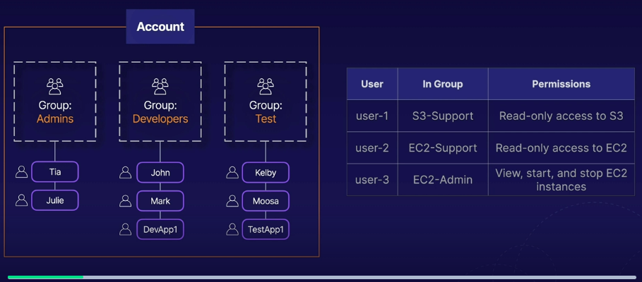
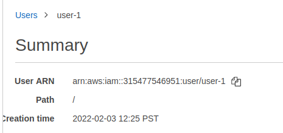
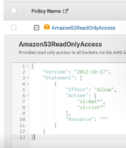

# aws intro to iam lab
The introductory lab focuses on users and groups, logging in as different users,
and assigning permissions to explore the access control list policies that users/groups
have.

This is the finalized account and user permissions for the lab:



## Region vs. Global - IAM
Within AWS a key thing to note is that Identity and Access Management (IAM) is
a **global** setting, meaning that any configurations withtin the account are
applied to **all regions within AWS**.

### Instances
Instances are regional within this lab; however, we could apply permissions regionally
to specific groups as well. This would restrict access to resources for that group
to ones deployed within a specific region.

## Amazon Resource Name (ARN)
The ARN is a unique identifier for each amazon resource that has been provisioned.
This is not exclusive to the IAM service, and instead serves as a unique ID for
any resource in AWS.

Example in IAM:
```
arn:aws:iam::315477546951:user/user-1
```

IAM user ARN, path, and creation time example:



## Access policies
Policies dictate the resources and permissions that a user/group has.

### Managed policies
These are policies that are managed by AWS for specific services.

Access can be granted directly to a group/user. When looking at a resource's
policies, any changes that are made to the policy are applied immediately to any
resource that has that attachment.

### Inline policies
This is a policy that is assigned to just 1 user or 1 group. These are typically
used to assign permissions in 1-off situations.

These can be viewed in JSON format to give us a look at the specific actions/permissions
and associated resources that the group can affect.

Example policy document in JSON:



### Editing permissions and explicit denials
Changing an effect from `Allow` to `Deny` will create an **explicit deny**,
this means that any `Deny` given to a user permission will override all other
policies that the user has been granted for that permission.

Essentially, any deny on that permission will deny them regardless of other
policies that may have granted access.

### Least privilege security
A user or role should have the least amount of permissions required to accomplish
what they need to do for their role.

This ensures that no single user or role could wreak havoc with lots of privileges.

