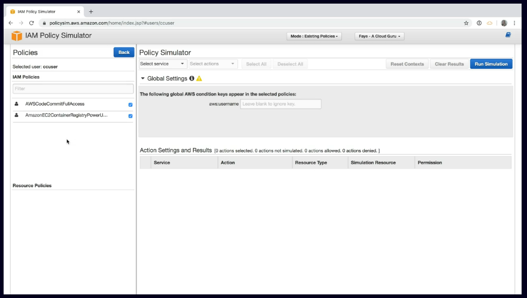

# aws testing iam permissions
Testing AWS IAM permissions should be done before committing them to production.
This allows us to validate that a policy works as expected.

## IAM policy simulator
The IAM policy simulator available in AWS allows users to test policies already
attached to existing users.

AWS' policy simulator allows users to troubleshoot IAM related issues.

[Link to the policy simulator](https://policysim.aws.amazon.com)

Example screen of the IAM policy simulator:

**Using the policy simulator:**
1. Selection of a service within the policy simulator allows you to check for permissions
against a specific resource.
1. You're then able to select a specific action for the user to run within the
scope of the simulation.
1. Review the results of the simulation that the user ran - the permissions will be displayed
as either denied or allowed.

## IAM exam tips
* IAM policy simulator
    * Test IAM permissions before committing them to production
    * Validate that the policy you've created works as expected
    * You can test policies attached to user in order to troubleshoot whether or not things work as expected

