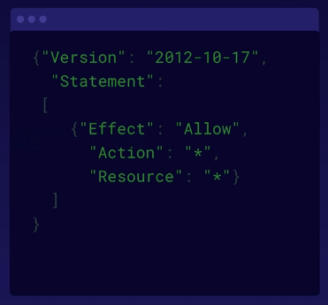

# aws iam summary
A chunk of summary information related to Identity and Access Management modules
in the AWS Developer Associate exam.

## Exam tips
* Users/groups/roles exist and are managed through the IAM service
* Policy documents can be reviewed in JSON form
* Roles can be assigned to users/apps/services to give specific AWS resource access
* IAM is global (not regional) and applies to the entirety of every region
    * **root accounts** in AWS have complete admin access and shouldn't be used for day-to-day access
    * New users have **no permissions when first created**
* New users receive an *access key ID and secret access key* when accounts are newly created
    * These are not used for console access and are different than a password
    * The access keys are used for access via APIs, CLIs, and programmatic access
    * CSVs of these keys are available for download at time of creation, but only once
* MFA should ***always*** be set up on the root account
* Password rotation can be established for all users to ensure proper password hygiene

Example IAM policy document:

