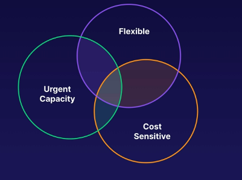
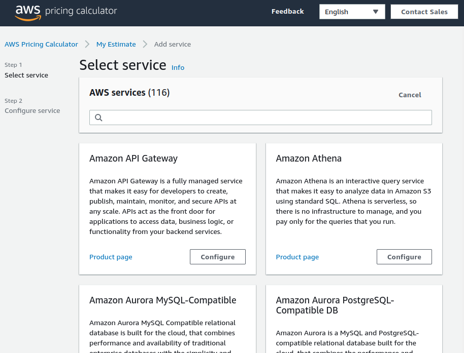

# aws ec2 pricing options
There are several EC2 instance pricing options that vary depending on the needs
of the developer/organization. This will dictate both bottom line costs and the
service type that you receive.

## On demand
Instances are paid by the hour (or the second) depending on the type of instance you
run. This is only paid **when the instance is running**.

This is good for on demand jobs that don't require 24/7 runtime. Keeping instances
online only during required intervals reduces costs significantly.

### Benefits of on demand
* Flexible, low cost and without up-front payment or long-term commitments
* Best for short term applications, spiky or unpredictable workloads, or workloads that can't be interrupted
* Great for "testing the waters" with apps that haven't been on EC2 or are in active development

## Reserved capacity
Reserved instances act as capacity that is set aside for 1 or 3 years. For committing
to a reserved instance you're able to receive discounts of up to 72% of the total
hourly cost (on demand pricing for that time, at a discounted rate).

This is at a regional level, not global. The reserved capacity isn't set in all regions,
just the region(s) that the reservation has.

### Benefits
* Predictable usage requirements with steady state
* Specific capacity requirements at any given time, ensuring that the resources are available when needed
* Paying up front reduces your costs, this is great if you're able to pay up front for capacity you know you'll need

### Types of reserved instances
1. Standard reserved instances - up to 72% off on demand pricing
    * This is a set # of instances of a certain size
    * Reserving means that you can't change your contract *at all*
1. Convertible reserved instances - up to 54% off on demand prices
    * We can conver tthe reservation to **any instance type of equal or greater value**
1. Scheduled reserved instances
    * Launches within a time window you define
    * Matches capacity reservation to a predictable recurring schedule
        * Reserving only a fraction of a day, week, or month

## Spot purchase
Purchase unused capacity at a discount of up to 90%.

The user sets a price threshold (max price to pay for an instance). This sets whether
or not to hibernate/terminate your instance when the spot price exceeds that.

Prices fluctuate with supply and demand; however, the compute capacity will terminate
once the price changes outside your spot threshold. This is good for saving money,
but doesn't work well for all applications.

### When to use spot instances
* Apps that have flexible start and end times
* Apps that are only feasible at very low compute prices
* Users with an urgent need for large amounts of additional computing capacity
    * Example use cases: algorithmic trading engines, genomic sequencing, or other compute heavy operations

## Dedicated server
A physical EC2 server that is dedicated specifically for your use.

This is the most expensive option, but it does allow for things like hardware-tied
software licenses or instances where you'd have regulations that don't allow for
multi-tenant hardware usage.

In scenarios where we can't have multi-tenant hardware sharing it would be advised
to go with this solution if on-prem isn't feasible.

### Benefits of dedicated hosts
* Compliance - regulatory requiremetns that may not support multi-tenant virtualization
* Licensing - licensing that doesn't support multi-tenancy or cloud deployments

### Purchasing options
1. On demand - purchased on demand (hourly)
1. Reserved instance - can be purchased as a reservation for up to 70% off the on demand pricing model

## Savings plans
Savings plans are flexible and offered to all instance types regarless of region.
This is exclusive to AWS compute services (like EC2, Lambda, and Fargate) and helps
to reduce costs.

### Savings offerings
1. Save up to 72% regardless of instance type or region
1. Commit to 1 or 3 years of service
    * This is a commitment to use a specific amount of compute power (measured in $/hour) for one-year or three-year period
1. Super flexible - supports EC2, Lambda, and Fargate

## AWS pricing calculator
This tool can be used to explore AWS services and help to understand the bills
and cost estimates for different services.

[Link to the AWS pricing calculator](https://calculator.aws)

Homescreen of the pricing calculator:

## Exam tips for EC2 instance pricing options
1. Remember pricing options for EC2 instances
    * on demand (pay by the hour)
    * reserved (up to 72% discount) for 1 or 3 years
    * spot usage with a max price based on supply and demand (up to 90% discount), terminates/hibernates when price is out of bounds
    * dedicated hosts great for server-bound licenses or compliance requirements

