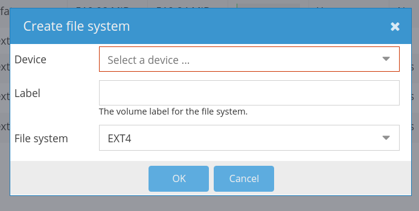
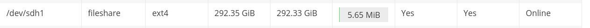
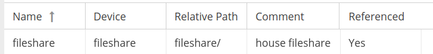
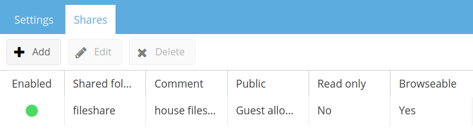

# create openmediavault smb share
Creating an SMB share in [OpenMediaVault](https://openmediavault.readthedocs.io/) is pretty
straightforward.

This will require an OpenMediaVault that is already set up, as well as a drive that
you are willing to format.

## Setup
Note: Before we start, we're going to be setting this up for guest access on your
network. This will ensure that anyone in your network can access the share to send
files to a general location.

1. Enter "File Systems"
    * Then click "Create"

2. Select a drive
    * Give it a name that you'll recognize
    * Then configure it to EXT4

3. Enter the "Shared Folders" section,
    * Then click "Add"
    * Name your fileshare (I use the same name as the device name)
    * Select your fileshare device
    * Create a meaningful path (I usually use the default)
    * Change permissions to "Everyone" (scroll to the bottom)
    * Add a comment (optional)
    * Save
        * **Note:** This will format the drive and take a few minutes to complete

4. Enter the "SMB/CIFS" section of OpenMediaVault
5. Under "General Settings" click "Enable"
6. Create our SMB share
    * Click the "Shares" tab
    * Click "Add"
    * Select our shared folder to use
    * Optionally add a comment
    * Change "Public" to "Guests Allowed"
    * Scroll down and enable "Inherit Permissions"
        * This ensures that new files will have the same permissions as the share
    * Save the fileshare

7. On your windows machine this should now be available under the "Network" tab
    * **Note:** On linux this will be available as a mounted drive, see my other notes on this

