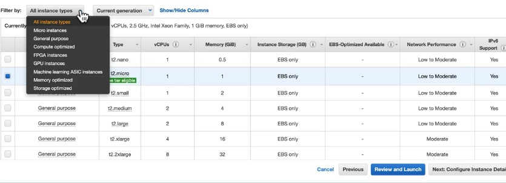

# EC2 instance types
Instance types dictate several key characteristics of the underlying EC2.

## Hardware
When launching an instance, the **instance type** determines the hardware of the host
computer used for the instance itself.

This can dictate things like:
* Hard drive type
* CPU core speeds
* Networking speeds
* Memory types

## Captabilities
Instance types offer varying configurations and types of:
* Compute
* Memory
* Storage

Instances of similar types/configurations are lumped together into *instance families*.

## Application requirements
Requirements of the application dictate which instance type to utilize. These
instance types are optimized based on different use cases, allowing the user
to choose an appropriate mix of resources for the application.

This ensures that we have flexibility from a user perspective, giving us free
range of what mix to use in our applications.


Example instance type list in the AWS console:



## Instance types
There are many instance types in to choose from in EC2. Each is divided into
its own section below.

**Instance type information:** The "Type" noted in the AWS Console is specific
to the "family", "size", and "generation" of the instance.

Example:
```
t2.micro -> General purpose 2nd generation micro-sized EC2
```

### General purpose
A balance of compute, memory, and network resources. This is a decent middle-of-the-road
approach to host a small/medium database, repetitive task, or running small
backend servers.

Example instance name:
```
t3.nano
```

### Micro instances
Eligible for the "free tier" of service. Following the first 12 months of initial
AWS signup you'll receive 750 hours per month of runtime for the micro services. These
have a pay-as-you-go standard service rate after the free tier is utilized.

**Note:** These are very small, they have <1gb of memory, 1 CPU, and has poor
network performance. Should not be used for high throughput/high traffic.

Example instance name:
```
t2.micro
```

### Compute optimized
A higher ratio of virtual CPUs to memory than other families. High CPU requirements
like batch processing, high performance science apps, or parallel processing may
be used here.

Example instance name:
```
c5n.large
```

### FPGA instances
Field programmable gate arrays are a processor (card) that can be programmed to run
specific hardware accelerations. This can handle high CPU performance,
large memory requirements, and high network bandwidth.

Instances of FPGA would be great for things like genomic processing, financial computing,
and accelerating things like algorithmic trading (low latency).

Example instance name:
```
f1.2xlarge
```

### GPU accelerated instances
Great for graphics and handle high CPU tasks with high network performance. These are
used for things like machine learning, graphics rendering, and video handling.

These are not exclusive to machine learning, as there is a "machine learning" instance
as well.

Example instance names:
```
g2.2xlarge
p2.xlarge
```

### Machine learning instances
ASIC chips (application specific integrated circuit) are custom built by AWS
and optimized for running machine learning applications. This handles things like
image recognition, speech recognition, natural language processing, and personalization
engines.

These are very high performance instances.

The chip name is a bit confusing (chip name is called `inferentia`) so to remember it
we can think of them as being a machine learning "inference".

Example instance name:
```
inf1.2xlarge
```

### Memory optimized instances
These are instances that meet high memory needs, up to hundreds of GB instances with
the lowest cost-per-gb of RAM. Good for things like databases (in-memory or otherwise).

Example instance names:
```
m2.xlarge
r5ad.4xlarge
x1e.16xlarge
z1d.xlarge
```

### Storage optimized instances
Allows for large amounts of storage to hit the EC2 instance. This can determine
the number of disks you have, all directly attached. This is good for high disk
I/O performance and low request latency of direct access to NVMe SSDs.

Example instance name:
```
d2.2xlarge
i3.xlarge
```

## Exam tips for EC2 instance types
* Instance types determine the hardware configuration and capabilities of the host
* Each instance type offers different compute, memory, and storage - grouped into families
* Select an instance type based on the requirements of the app

