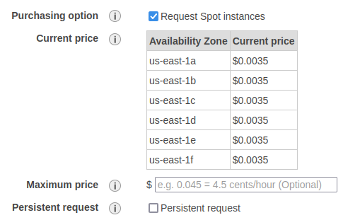

# launching an ec2 instance
These are some general notes from launching an EC2 instance. This demo from [acloudguru.com](https://acloudguru.com)
has us configuring an EC2 instance as a web server.

## General notes
* Amazon Machine Image (AMI) - The software configuration (OS, application server, and apps)
    required to launch the instance.
    * These images might be preconfigured for things like machine learning or databases
* Spot instances are at different price tiers and availability zones, but have reduced cost

Example spot instance pricing:



### Startup scripts
* The user data section of the "advanced details" on EC2 creation allows for bootstrap scripts
    * These are scripts/commands we want run when the instance is started
    * Example: Update our operating system packages on startup

### Storage volumes
* For storage we can choose to add new volumes and file systems for our EC2 instance
    * Storage can be encrypted using KMS (key manage service) and it is very easy to manage

### Tagging instances
* Tags are a way to organize instances with key-value pairs for naming, team ownership, or apps

### Security
* Security groups are the firewalls that we have for our EC2. This is for access control
    * By default we have SSH on port 22
    * Adding a new HTTP rule for port 80 with a source of "anywhere" is what a webserver would need
        * IPV4 notation: `0.0.0.0/0`
        * IPV6 notation: `::/0`

### SSH into the EC2
* On creation we have to create a key pair, and are given a `.pem` file
    * This needs to be stored in a secure location and shared sparingly
    * Keys need to have their permissions set, using `chmod 400 <key name>`

Changing our permissions of the `.pem` file:
```bash
chmod 400 <key name>.pem
```

To SSH into our server:
```bash
ssh ec2-user@<public IP> -i <key name>.pem

# continue?
> yes
```

### Updating the EC2
We can do this as `root`, or as our `ec2-user`.

```bash
# -y for "yes"
yum update -y
```

### Starting an Apache webserver at boottime
Creating an Apache webserver instance on startup of the EC2 instance will turn this
into a tiny webserver.

```bash
# install Apache webserver
yum install httpd -y

# starts service
systemctl start httpd

# enable the service on startup
systemctl enable httpd

# check the status
systemctl status httpd
```

