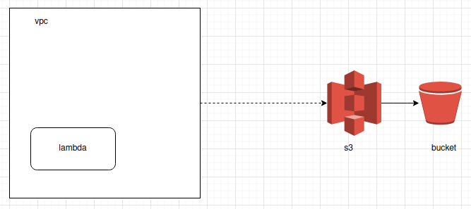

# lambda access to s3 inside a vpc
While working on a lambda deployment I ran into a use case where I needed access
to a provisioned RDS instance inside of a VPC. This was a simple task to complete,
just adding the lambda to the VPC.

However, the lambda already relied on access to S3, this was no longer accessible
because it was now limited to internal traffic within that VPC instance.

[Link to adding a lambda to the VPC](https://aws.amazon.com/blogs/aws/new-access-resources-in-a-vpc-from-your-lambda-functions/)

Sample configuration with the lambda and VPC:

## Solution -> NAT tunnel or VPC endpoint
When researching this issue I happened upon quite a few resources that discussed
different implementations that would allow the lambda to have access to the S3 buckets
it required.

### NAT tunnel
A NAT tunnel instance creates a NAT tunnel within the VPC between AWS resources.
This is supposedly a pricier solution than the (newly added) VPC endpoints.

Providing this instance to the lambda would be done using a security group.

[Link to creating a NAT tunnel](https://docs.aws.amazon.com/vpc/latest/userguide/VPC_NAT_Instance.html)

### VPC endpoint
A VPC endpoint will accomplish a similar role in allowing resources to connect
to one another through an AWS managed connection.

Providing this to the lambda would be through the security group as well.

[Link to creating a VPC endpoint](https://aws.amazon.com/blogs/aws/new-vpc-endpoint-for-amazon-s3/)

