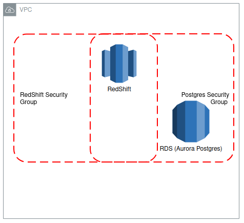
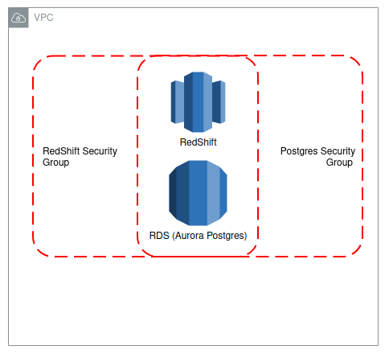

# federated queries from postgres to redshift without enhanced vpc routing
RedShift boasts the abililty to create an external schema that serves as a
connection to RDS instances. I'm briefly going to cover resources that exist
for creating Postgres -> RedShift federated queries **without** using
enhanced VPC routing.

### Resources
* [AWS Documentation on Federated Queries](https://docs.aws.amazon.com/redshift/latest/dg/getting-started-federated.html)
* [Creating external schemas in RedShift](https://docs.aws.amazon.com/redshift/latest/dg/r_CREATE_EXTERNAL_SCHEMA.html)
* [AWS Federated Query examples](https://docs.aws.amazon.com/redshift/latest/dg/federated_query_example.html)
* [Blog post with similar architecture discussion](https://spaeder.io/2020/04/20/aws-redshift-federated-querying-from-postgres/)
* [AWS Documentation on VPC Security Groups](https://docs.aws.amazon.com/vpc/latest/userguide/VPC_SecurityGroups.html)
* [AWS Documentation on Enhanced VPC Routing](https://docs.aws.amazon.com/redshift/latest/mgmt/enhanced-vpc-routing.html)
* [AWS Documentation on Secrets Manager](https://aws.amazon.com/secrets-manager/)
* [AWS Documentation on managing RedShift security groups](https://docs.aws.amazon.com/redshift/latest/mgmt/working-with-security-groups.html)

## General overview
Our architecture will require either:
* RDS and RedShift to exist within the same VPC
* There to be a NAT that exists between the separate VPCs

We'll be discussing same VPC instances. Our architecture looks like the following:



## Implementation of the federated query
The implementation of this service is broken out below.

### Prerequisites:
* An existing user in Postgres with access to what you want in RedShift
* [An IAM role that RedShift can use to access the instance](https://docs.aws.amazon.com/redshift/latest/dg/federated-create-secret-iam-role.html)
* A secret containing the Postgres user/password in the AWS Secrets Manager

### Implementation
1. Adding our external schema to the RedShift cluster will provide us access to the instance.
This query is directly pulled from the AWS Docs
```sql
-- Runs in RedShift
CREATE EXTERNAL SCHEMA my_redshift_schema_name
FROM POSTGRES
DATABASE 'my_postgres_database_name' SCHEMA 'my_postgres_schema'
URI 'endpoint to aurora postgres hostname'
IAM_ROLE 'arn:aws:iam::123456789012:role/my/redshift/user/role/'
SECRET_ARN 'arn:aws:secretsmanager:us-west-2:123456789012:secret:federation/test/dataplane-apg-creds-YbVKQw';
```

2. Verify that the schema now exists in RedShift
3. Likely we'll run into an issue with there being timeouts if we attempt to connect to a table like below

Check the table returns values from Postgres:
```sql
select *
from my_redshift_schema_name.some_table
```

Producing something like:
```
SQL Error: Invalid Operation: Failed to incorporate external table
into local catalog. Error= Unable to connect to endpoint with address xxxxxxx"
```

4. Add RedShift to the security group of our instance, this will now change our architecture to the following



5. The query we ran to check the RedShift returns from Postgres should now work
Check the table returns values from Postgres:
```sql
select *
from my_redshift_schema_name.some_table
```

