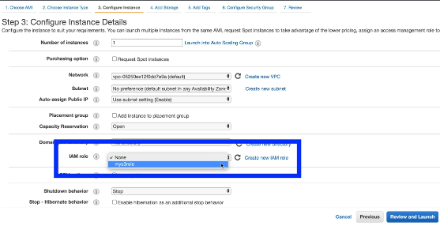

# aws ec2 instance with s3 role
Certain services within AWS can be assigned IAM roles that allow them to access
other services.

## Example
Creating an EC2 instance, then assigning an access role that allows it full access
to S3 buckets.

New role for the EC2 instance:
```json
{
    "Version": "2012-10-17",
    "Statement": [
        {
            "Effect": "Allow",
            "Action": [
                "sts:AssumeRole"
                "s3:*"
            ],
            "Principal": {
                "Service": [
                    "ec2.amazonaws.com"
                ]
                "Resource": [
                    "*"
                ]
            }
        }
    ]
}
```

**Note:** Do not use a `Resource "*"` in production. This yields access to everything.
Follow the [principal of least privilege](https://us-cert.cisa.gov/bsi/articles/knowledge/principles/least-privilege#:~:text=The%20Principle%20of%20Least%20Privilege%20states%20that%20a%20subject%20should,control%20the%20assignment%20of%20rights.).

This would then be assigned during the instance creation for an EC2 instance.


## Usage
From within the EC2 instance (via SSH or otherwise) the AWS CLI is now usable with the
EC2 instance to execute the commands it was given access to.

From the policy document above, the EC2 instance can create, read, list, retrieve,
and update S3 buckets within the account.

