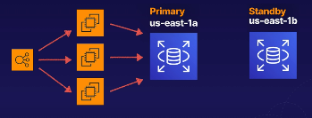
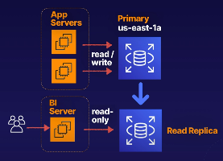

# aws rds multi az read replicas
RDS instances in AWS have a multitude of options for resiliancy and high throughput.

## Multi Availability Zone
An exact copy of your production database in another availability zone.

Example:
If you have an application running on EC2 instances behind an elastic load balancer.
The data for this application is stored within an RDS instance with multi AZ enabled.

Architecture for this would look like the below diagram:

With multi AZ enabled we have a primary node and standy (secondary) node.
This would replicate data between the primary instance and the standby for failover
purposes.

Within normal circumstances with operations running smoothly, the secondary node is not
visible. However, if something goes wrong (data center outage, hardware issue) then we
receive a failover event that will push all events to the secondary.

AWS has done the heavy lifting for this, ensuring that all writes to the production database
are synchronized between the two nodes.

**Note:** This is for disaster recovery and **NOT** for database performance enhancements.

**Note:** The main purpose of the multi az is to be resiliant in the case of failures,
planned maintenance, etc. This is typically handled within 35 seconds of a failure.

**Note:** Compared to [SQL Server Always on Availability Groups](https://docs.microsoft.com/en-us/sql/database-engine/availability-groups/windows/always-on-availability-groups-sql-server?view=sql-server-ver15)
this offering is significantly faster than some larger OLTP failovers that I have
experienced (some taking upwards of half an hour).

### Applicable database types for multi az
Most database engine types can be multi AZ, including:
* Microsoft SQL Server
* Oracle
* MySQL
* PostgreSQL
* MariaDB

## RDS Read Replicas
A read-only copy of your primary database. This ensures that you have availabity
for things like reports to other services.

This would be useful for read heavy operations that we don't want to have an impact
on the performance of a primary write instance. By offloading this to a read instance we
can ensure that the application users won't be impacted.

Example architecture of an application with a read-only replica for reporting:

**Note:** We can have a read-only instance in the same availability zone, cross availability zones,
or even cross region.

### Features
* Each read replica will have its own DNS endpoint that is different and independent from
the primary database.
    * These replicas can be promoted to independent databases, though this
    will break the replication from the original database (this also changes the DB to read/write).
* Multiple read replicas are supported
    * MySQL, MariaDB, PostgreSQL, Oracle, and SQL Server allow up to 5 read replicas per DB instance

**Note:** This is primarily for scaling performance, not for disaster recovery.

### General requirements
* Automatic backups must be enabled in order to deploy a read replica
    * Likely this is used for the initial setup

## Exam tips for Multi AZ and Read Replicas
* Multi AZ:
    * An exact copy of the prod database in another availability zone
    * Used for disaster recovery
    * In the event of a failure, RDS automatically fails to the standby
* Read Replicas:
    * A read-only copy of the primary database in the same AZ, cross AZ, or cross region
    * Used to increase and scale read performance on heavy workloads
    * Great for read-heavy workload slike reporting, takes the load off our primary database

