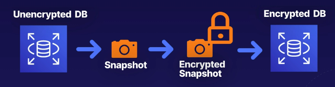

# aws rds snapshots and backups
There are two ways to back up an AWS RDS instance: database snapshots and database
backups.

## Database snapshots
Database snapshots are a point in time copy of the storage volume attached to a
database instance.
* Manual, ad-hoc, and user-initiated
* A snapshot of the storage volume on the DB instance

### Known state
Backing up your DB instance with an automated snapshot would be beneficial if you
are making changes that you know may have an adverse effect. This would allow you to
complete a restore to a "known state" as frequently as you need to.

A snapshot on an ad-hoc basis would be ideal for things taking place outside the
maintenance window, or restores that are frequent enought to warrant a faster method
than point in time recovery (for kick off, not restore time).

### Backup storage
These have a retention period of forever. They don't have an expiration, even after
deleting an RDS intance.

## Automated backups
These are enabled by default with either backups or snapshots.
* Defined in a backup window you determine
* Includes transaction lots that are used to replay transactions
* RDS takes a full daily backup, or snapshot, and also stores logs throughout the day
* During bacup windows storage I/O may be suspended for a few seconds while
backups initialize. This increases latency during kickoff and the backup

**Note:** A lot more value for the cost provided than snapshots.

### Point in time recovery
Can recover a database to any point in time within a retention period of 1-35 days.

Recovery will first choose the most recent daily backup and apply a transaction
log relevant to that day, up to the recovery point you select.

### Backup storage
Automated backups and snapshots are stored in s3.

Storage is free, up to an equal size of your database. For instance, a 10GB database
would get 10GB of free backup storage.

## Restoring an RDS
When using either a database snapshot or a backup the restore will create a **new RDS endpoint**.
All restorations will create a new instance with a new endpoint, to allow user flexibility.

## Encryption at rest
Enabling encryption at creation time is done through the encryption option in the console.
This is done using the [AWS Key Management Service (KMS)](https://aws.amazon.com/kms/) with
AES-256 encryption.

All database storage (underlying storage, snapshots, backups, logs, read replicas) are
encrypted.

### Workaround for restoring unencrypted -> encrypted databases
Databases can't have encryption enabled after they are already created. To work around this
we're able to:
1. Take a snapshot of the DB
2. Encrypt the snapshot itself
3. Restore the encrypted snapshot, forcing it to become an encrypted RDS instance

Example workflow for restoring unencrypted data to an encrypted instance:

