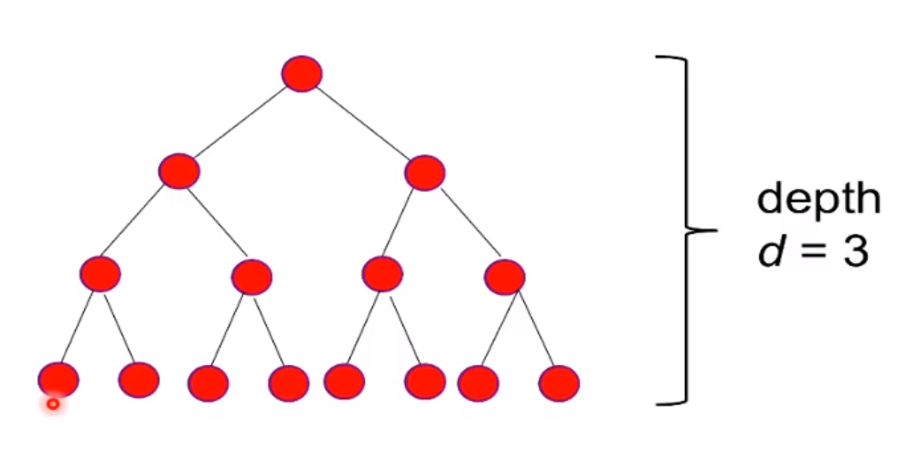

# summations in discrete math
An important operation in numerical sequences is adding terms. This is interchangeably called
**series** or **summations**. The summation notation is useful when counting operations
in things like loops, nested loops, and dealing with finite series (an upper limit of a fixed integer).

## Summation notation
When writing a summation notation we should be able to get back to the expanded
sequence easily from the shorthand notation.

Given a sequence:
`am, am+1, am+2, ..., an`

Sum of the terms of a sequence:
`am + am+1 + am+2 + ... + an`

The sum of a finite series would be a **partial sum** of the sequence.

```latex
\sum_{k=m}^n a_k
```

This is commonly known as the **sigma notation** for the summation shorthand, where:
* `k` is the index
* `m` is the lower limit
* `n` is the upper limit
* Our index increments 1 at a time from `m` -> `n`
* `a` sub `k` is the value at the index

Example:
Summation for - `1^2 - 2^2 + 3^2 - 4^2 + 5^2 - 6^2 + 7^2`

```latex

= \sum_{k=1}^7 (-1)^{k+1} * k{2}

```

Example:
Summation for - `3^3 + 3^4 + ... + 3^40`

```latex

= \sum_{k=3}^40 3{k}

```

## Closed form formula for calculating summations in progressions
This ensures we're able to easily add summations together for large sequences.

Example:
For k = 1 to 100 do computation requiring k units of time.

**time units at iteration k**: ak = k
(sub k)

`a1 + ... + a100` is the same as:

```latex

= \sum_{k=1}^100 a_k = \sum_{k=1}^100 k

```

### Summation of arithmetic progressions
Using the example above, we can use the following to easily calculate our total.

```latex

\sum_{k=1}^n k = ((n+1) * n)/2

```

Answer to the above:
```
((100 + 1) * 100)/2 = 5050
```

## Summations in geometric progression
Within a binary tree, we can determine summations based on the depth.

Binary tree example to calculate node totals:


Example:
How many nodes are in a depth of 3 in a balanced binary tree?

**nodes at layer k:** ak = 2^k

`a0 + ... + ad` is the same as:

```latex

\sum_{k=0}^d k = \sum_{k=0}^d 2{k}

```

## Closed form formula for geometric progression summations
We can utilize the below generic formula for determining the sum of a geometric progression.

```latex

\sum_{k=0}^n r{k} = (r{n+1} - 1)/(r - 1)

```

The above example would be:
```
(2^(3 + 1) - 1)/(2 - 1)) = 15
```

## Properties of sum transformations (changing sums)
We can change summation notations to split out nested sums to provide clarity.

### Splitting two summations
If we have two or more summations together with the same constants we can
handle them separately.

```latex

\sum_{k=m}^n (a_k + b_k) = \sum_{k=m}^n a_k + \sum_{k=m}^n b_k

```

### Multiplying by a constant factor
When multiplying we can pull the factor out then multiply afterward.

```latex

\sum_{k=m}^n ca_k = c * \sum_{k=m}^n a_k

```

### The sum of constant terms
When utilizing a constant we can determine the summation of the constant's terms
by utilizing the below.

```latex

\sum_{k=m}^n c = c(n - m + 1)

```

### Subtracting extra terms
We can subtract the extra terms from one summation to get another summation.

```latex

\sum_{k=m}^n a_k = \sum_{k=1}^n a_k - \sum_{k=1}^m-1 a_k

```

Example:
We can determine the summation of the below by creating 2 summations, then subtracting
the difference.

```latex

\sum_{k=5}^10 k = \sum_{k=1}^10 k - \sum_{k=1}^4 k

```

The above is now transformed to the closed forms:
```
= (10(10 + 1))/2 - (4(4 + 1))/2
```

### Adding or subtracting numbers to indexes/limits to work with it easier
We can change the values of our upper/lower limits by a constant (the same for each)
to make the value of the total easier to work with.

```latex

\sum_{k=m}^n a_k = \sum_{j=m+l}^n+l a_{j-l}

```

Example:

```latex

\sum_{k=5}^10 k, Say j = k - 4, k=j + 4

```

```latex

\sum_{j=1}^6 (j + 4) = \sum_{j=1}^6 j + \sum_{j=1}^6 4

```

The above is now:
```
= (6(6 + 1))/2 + 4 * (6 - 1 + 1)
```

### The telescoping sum in summations
If a summand can be expressed as a difference of two terms, then we can have
a cascade of cancellations that greatly simplifies our end formula.

```latex

\sum_{k=1}^n (a_k - a_{k+1}) = a_1 - a_{n+1}

```

**Note:** We can rewrite our summands to reach this.

Example:
```latex

\sum_{k=1}^n (1/(n(n+1)))

= \sum_{k=1}^n ((1/n) - (1/(n + 1)))

= (1/1 - 1/2) + (1/2 - 1/3) + (1/3 - 1/4) + ... + (1/(n-1) - 1/n) + (1/n - (1/(n + 1)))

```

### Exploring double sums, nested summations
These are similar to nested for loops. We have to compute the inner summation, then
calculate the outer summation.

```latex

\sum_{i=1}^n \sum_{j=1}^m a_{ij} = \sum_{i=1} a_{i1} + a_{i2} + ... + a_{im}

```

Example:

```

\sum_{i=1}^3 \sum_{j=1}^2 ij = \sum_{i=1} (i * 1 + i * 2) = \sum_{i=1}^3 3i = 3 * 3(3 + 1)/2 = 18

```

